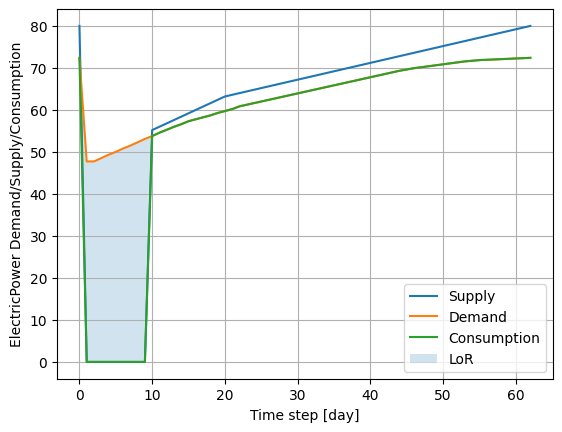
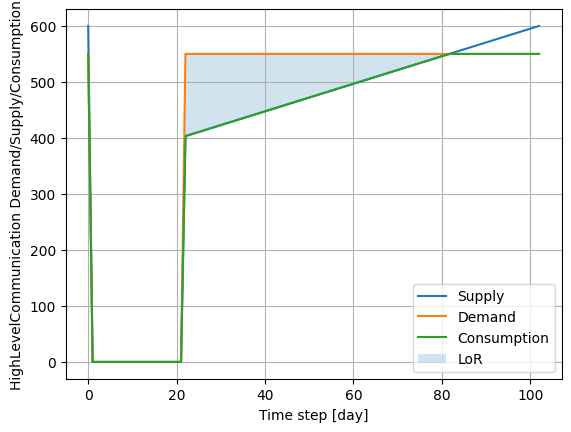
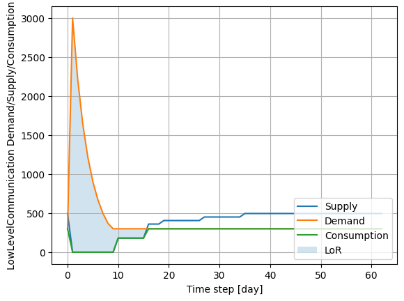
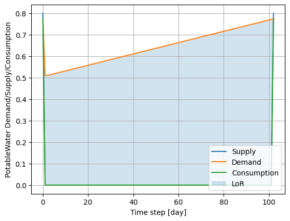
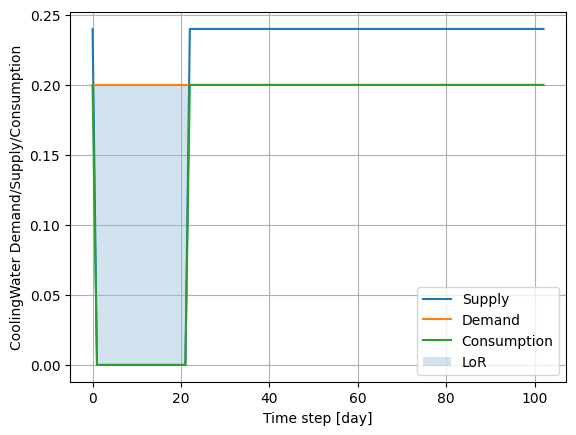
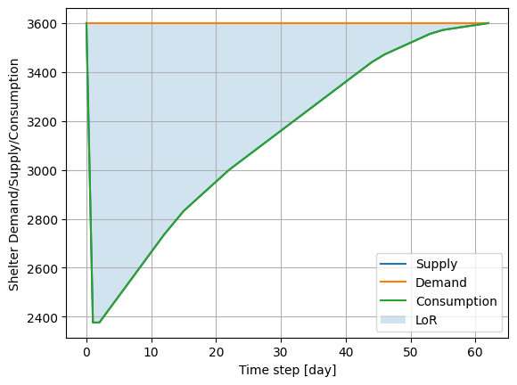
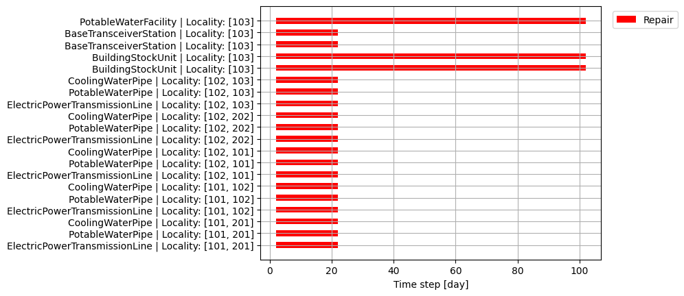

Example 2
=========

Example 2 shows how **pyrecodes** can be used to assess the resilience of interdependent infrastructure systems and housing in a virtual community affected by a scenario disaster. This is a toy example to illustrate how system recovery is simulated following a disaster and how component interdependencies are captured in iRe-CoDeS.

.. figure:: ../../figures/Example_2_Community.png
        :alt: Virtual community in Example 2.

        Virtual community in Example 2.

Running the example
-------------------

Example 2 Jupyter notebook illustrates how to run the pyrecodes simulation and plot the post-disaster supply/demand/consumption dynamics and the components' recovery gantt chart.

Run the example online using `Google Colab <https://colab.research.google.com/github/NikolaBlagojevic/pyrecodes/blob/main/Example2_VirtualCommunity_Colab.ipynb>`_.
    
Alternatively, the example can be run locally by downloading the `Example 2 Jupyter notebook <https://github.com/NikolaBlagojevic/pyrecodes/blob/main/Example2_VirtualCommunity.ipynb>`_ and the required files from the `Example 2 folder <https://github.com/NikolaBlagojevic/pyrecodes/tree/main/Example%202>`_. 

Virtual community description
-----------------------------

Virtual community consists of the building stock and three interdependent infrastructure systems: the Electric Power Supply System, the Water Supply System and the Cellular Communication System. Community is discretized into 20 localities connected with links, containing components and/or representing link intersections. 

The Electric Power Supply System provides electric power produced by Electric Power Plants (EPPs) and transferred to users through the Transsmision Lines, represented as links between localities. 

The Water Supply System provides cooling and potable water to the community. The two resources are supplied by the Cooling Water Facilities (CWFs) and Potable Water Facilities (PWFs) and transferred by cooling water pipes and potable water pipes that have the same topology as the transmission lines, represents as black lines in the figure above.

The Cellular Communication System consists of Base Station Controllers (BSCs) that control Base Transceiver Stations (BTSs) by providing High Level Communication resource. The BTSs then provide Low Level Communication to the community.

The components are interdependent as they require resources provided by other systems to operate. The interdependencies are defined by the resource amounts components need to operate, as specified in the **component library** file.

Componets are assigned initial post-disaster damage levels as defined in the *example_2_damage_input.txt* in the Example 2 folder. Such damage levels can be obtained using hazard and vulnerability models `[link] <https://www.research-collection.ethz.ch/bitstream/handle/20.500.11850/463555/1/7d-0003_Published.pdf>`_.

Component library
-----------------

In the following component templates used in Example 2 are presented. Please refer to Example 1 and the `How to use pyrecodes <./user_guide.html>`_ page for a more detailed description of the different sections in the component library.

Electric Power Plant
`````````````````````
.. toggle:: 

        .. code-block:: json

                "ElectricPowerPlant": {
                "ComponentClass": "ComponentLevelRecoveryActivitiesModel",
                "RecoveryModel": {
                "Type": "SingleRecoveryActivity",
                "Parameters": {
                        "Repair": {
                        "Duration": {
                                "Deterministic": {
                                "Value": 100
                                }
                        }
                        }
                },
                "DamageFunctionalityRelation": {
                        "Type": "ReverseLinear"
                }
                },
                "Supply": {
                        "ElectricPower": {
                                "Amount": 40,
                                "FunctionalityToAmountRelation": "Linear",
                                "UnmetDemandToAmountRelation": "Binary"
                        }
                },
                "OperationDemand": {
                        "ElectricPower": {
                                "Amount": 0.2,
                                "FunctionalityToAmountRelation": "Constant"
                        },
                        "LowLevelCommunication": {
                                "Amount": 0.001,
                                "FunctionalityToAmountRelation": "Constant"
                        },
                        "CoolingWater": {
                                "Amount": 0.05,
                                "FunctionalityToAmountRelation": "Constant"
                        }
                }

Base Station Controller
`````````````````````````

.. toggle:: 

        .. code-block:: json

                "BaseStationController": {
                        "ComponentClass": "StandardiReCoDeSComponent",
                        "RecoveryModel": {
                        "Type": "ComponentLevelRecoveryActivitiesModel",
                        "Parameters": {
                                "Repair": {
                                "Duration": {"Deterministic": {"Value": 100}} 
                                }       
                        },
                        "DamageFunctionalityRelation": {
                                "Type": "ReverseLinear"
                        }
                        },       
                        "Supply": {
                                "HighLevelCommunication": {
                                        "Amount": 300,
                                        "FunctionalityToAmountRelation": "Linear",
                                        "UnmetDemandToAmountRelation": "Binary"
                                }
                        },
                        "OperationDemand": {
                                "ElectricPower": {
                                        "Amount": 0.2,
                                        "FunctionalityToAmountRelation": "Constant"                
                                },          
                                "CoolingWater": {
                                        "Amount": 0.05,
                                        "FunctionalityToAmountRelation": "Constant"                
                                }         
                        }
                }

Base Transceiver Station
`````````````````````````
.. toggle:: 

        .. code-block:: json
                
                "BaseTransceiverStation": {
                        "ComponentClass": "StandardiReCoDeSComponent",
                        "RecoveryModel": {
                        "Type": "ComponentLevelRecoveryActivitiesModel",
                        "Parameters": {
                                "Repair": {
                                "Duration": {"Deterministic": {"Value": 20}}   
                                }                
                        },
                        "DamageFunctionalityRelation": {
                                "Type": "ReverseBinary"
                        }
                        },       
                        "Supply": {
                                "LowLevelCommunication": {
                                        "Amount": 45,
                                        "FunctionalityToAmountRelation": "Linear",
                                        "UnmetDemandToAmountRelation": "Binary"
                                }
                        },
                        "OperationDemand": {
                                "ElectricPower": {
                                        "Amount": 0.1,
                                        "FunctionalityToAmountRelation": "Linear"                
                                },
                                "HighLevelCommunication": {
                                        "Amount": 50,
                                        "FunctionalityToAmountRelation": "Linear"                
                                }
                        }
                }

Potable Water Facility
```````````````````````

.. toggle:: 

        .. code-block:: json
                
                "PotableWaterFacility": {
                        "ComponentClass": "StandardiReCoDeSComponent",
                        "RecoveryModel": {
                        "Type": "ComponentLevelRecoveryActivitiesModel",
                        "Parameters": {
                                "Repair": {
                                "Duration": {"Deterministic": {"Value": 100}}  
                                }      
                        },
                        "DamageFunctionalityRelation": {
                                "Type": "ReverseBinary"
                        }
                        },
                        "Supply": {
                                "PotableWater": {
                                        "Amount": 0.2,
                                        "FunctionalityToAmountRelation": "Linear",
                                        "UnmetDemandToAmountRelation": "Binary"
                                }
                        },
                        "OperationDemand": {            
                                "ElectricPower": {
                                        "Amount": 0.1,
                                        "FunctionalityToAmountRelation": "Constant"
                                }
                        }
                },

Cooling Water Facility
```````````````````````

.. toggle:: 

        .. code-block:: json

                "CoolingWaterFacility": {
                        "ComponentClass": "StandardiReCoDeSComponent",
                        "RecoveryModel": {
                        "Type": "ComponentLevelRecoveryActivitiesModel",
                        "Parameters": {
                                "Repair": {
                                "Duration": {"Deterministic": {"Value": 20}}  
                                }      
                        },
                        "DamageFunctionalityRelation": {
                                "Type": "ReverseLinear"
                        }
                        },
                        "Supply": {
                                "CoolingWater": {
                                        "Amount": 0.06,
                                        "FunctionalityToAmountRelation": "Linear",
                                        "UnmetDemandToAmountRelation": "Binary"
                                }
                        },
                        "OperationDemand": {            
                                "ElectricPower": {
                                        "Amount": 0.2,
                                        "FunctionalityToAmountRelation": "Constant"
                                },
                                "LowLevelCommunication": {
                                        "Amount": 0.001,
                                        "FunctionalityToAmountRelation": "Constant"
                                }
                        }
                },

Building Stock Unit
```````````````````

.. toggle:: 

        .. code-block:: json

                "BuildingStockUnit": {
                        "ComponentClass": "BuildingStockUnitWithEmergencyCalls",
                        "RecoveryModel": {
                        "Type": "ComponentLevelRecoveryActivitiesModel",
                        "Parameters": {
                                "Repair": {
                                "Duration": {"Deterministic": {"Value": 100}}  
                                }      
                        },
                        "DamageFunctionalityRelation": {
                                "Type": "ReverseLinear"
                        }   
                        },
                        "Supply": {
                                "Shelter": {
                                        "Amount": 400,
                                        "FunctionalityToAmountRelation": "Linear",
                                        "UnmetDemandToAmountRelation": "Constant"
                                },
                                "FunctionalHousing": {
                                        "Amount": 400,
                                        "FunctionalityToAmountRelation": "Linear",
                                        "UnmetDemandToAmountRelation": "Linear"
                                }
                        },
                        "OperationDemand": {
                                "ElectricPower": {
                                        "Amount": 7.7,
                                        "FunctionalityToAmountRelation": "Linear"
                                },
                                "LowLevelCommunication": {
                                        "Amount": 33.3,
                                        "FunctionalityToAmountRelation": "Constant",
                                        "PostDisasterIncreaseDueToEmergencyCalls": "True"
                                },
                                "PotableWater": {
                                        "Amount": 0.086,
                                        "FunctionalityToAmountRelation": "Linear"
                                },
                                "Shelter": {
                                        "Amount": 400,
                                        "FunctionalityToAmountRelation": "Constant"            
                                },
                                "FunctionalHousing": {
                                        "Amount": 400,
                                        "FunctionalityToAmountRelation": "Constant"           
                                }              
                        }
                },

Electric Power Transmission Line
`````````````````````````````````

.. toggle::

        .. code-block:: json

                "ElectricPowerTransmissionLine": {
                        "ComponentClass": "StandardiReCoDeSComponent",
                        "RecoveryModel": {
                        "Type": "ComponentLevelRecoveryActivitiesModel",
                        "Parameters": {
                                "Repair": {
                                "Duration": {"Deterministic": {"Value": 20}}    
                                }    
                        },           
                        "DamageFunctionalityRelation": {
                                "Type": "ReverseLinear"
                        }   
                        },
                        "Supply": {
                                "ElectricPowerTransferService": {
                                        "Amount": 1000,
                                        "FunctionalityToAmountRelation": "Linear",
                                        "UnmetDemandToAmountRelation": "Constant"
                                }
                        }   
                }

Potable Water Pipe
```````````````````

.. toggle::

        .. code-block:: json

                "PotableWaterPipe": {
                        "ComponentClass": "StandardiReCoDeSComponent",
                        "RecoveryModel": {
                        "Type": "ComponentLevelRecoveryActivitiesModel",
                        "Parameters": {
                                "Repair": {
                                "Duration": {"Deterministic": {"Value": 20}}    
                                }    
                        },           
                        "DamageFunctionalityRelation": {
                                "Type": "ReverseLinear"
                        }   
                        },
                        "Supply": {
                                "PotableWaterTransferService": {
                                        "Amount": 1000,
                                        "FunctionalityToAmountRelation": "Linear",
                                        "UnmetDemandToAmountRelation": "Constant"
                                }
                        }   
                }

Cooling Water Pipe
```````````````````

.. toggle::

        .. code-block:: json

                
                "CoolingWaterPipe": {
                        "ComponentClass": "StandardiReCoDeSComponent",
                        "RecoveryModel": {
                        "Type": "ComponentLevelRecoveryActivitiesModel",
                        "Parameters": {
                                "Repair": {
                                "Duration": {"Deterministic": {"Value": 20}}    
                                }    
                        },           
                        "DamageFunctionalityRelation": {
                                "Type": "ReverseLinear"
                        }   
                        },
                        "Supply": {
                                "CoolingWaterTransferService": {
                                        "Amount": 1000,
                                        "FunctionalityToAmountRelation": "Linear",
                                        "UnmetDemandToAmountRelation": "Constant"
                                }
                        }   
                }

Bridge
```````

.. toggle::

        .. code-block:: json

                "Bridge": {
                        "ComponentClass": "StandardiReCoDeSComponent",
                        "RecoveryModel": {
                        "Type": "ComponentLevelRecoveryActivitiesModel",
                        "Parameters": {
                                "Repair": {
                                "Duration": {"Deterministic": {"Value": 100}}    
                                }    
                        },           
                        "DamageFunctionalityRelation": {
                                "Type": "ReverseLinear"
                        }   
                        },
                        "Supply": {
                                "CarrierService": {
                                        "Amount": 1000,
                                        "FunctionalityToAmountRelation": "Linear",
                                        "UnmetDemandToAmountRelation": "Constant"
                                }
                        }   
                }
                

System configuration
--------------------

Sections of the system configuration file for Example 2 are presented next. Please refer to Example 1 for a more in-depth explanation of system configuration file sections.

Constants
`````````

.. toggle::

        .. code-block:: json

                "Constants": {
                        "START_TIME_STEP": 0,
                        "MAX_TIME_STEP": 500,
                        "DISASTER_TIME_STEP": 1
                }

Content
```````

.. toggle::

        .. code-block:: json

                "Content": {
                        "Locality 101": {
                        "Coordinates": {
                                "X": 1,
                                "Y": 1
                        },
                        "LinkTo": {
                                "Locality 201": [
                                "ElectricPowerTransmissionLine",
                                "PotableWaterPipe",
                                "CoolingWaterPipe"
                                ],
                                "Locality 102": [
                                "ElectricPowerTransmissionLine",
                                "PotableWaterPipe",
                                "CoolingWaterPipe"
                                ]
                        }
                        },
                        "Locality 102": {
                        "Coordinates": {
                                "X": 2,
                                "Y": 1
                        },
                        "LinkTo": {
                                "Locality 101": [
                                "ElectricPowerTransmissionLine",
                                "PotableWaterPipe",
                                "CoolingWaterPipe"
                                ],
                                "Locality 202": [
                                "ElectricPowerTransmissionLine",
                                "PotableWaterPipe",
                                "CoolingWaterPipe"
                                ],
                                "Locality 103": [
                                "ElectricPowerTransmissionLine",
                                "PotableWaterPipe",
                                "CoolingWaterPipe"
                                ]
                        }
                        },
                        "Locality 103": {
                        "Coordinates": {
                                "X": 3,
                                "Y": 1
                        },
                        "ComponentsInLocality": {
                                "BuildingStockUnit": 2,
                                "BaseTransceiverStation": 2,
                                "PotableWaterFacility": 1
                        },
                        "LinkTo": {
                                "Locality 102": [
                                "ElectricPowerTransmissionLine",
                                "PotableWaterPipe",
                                "CoolingWaterPipe"
                                ],
                                "Locality 203": [
                                "ElectricPowerTransmissionLine",
                                "PotableWaterPipe",
                                "CoolingWaterPipe"
                                ],
                                "Locality 104": [
                                "ElectricPowerTransmissionLine",
                                "PotableWaterPipe",
                                "CoolingWaterPipe"
                                ]
                        }
                        },
                        "Locality 104": {
                        "Coordinates": {
                                "X": 4,
                                "Y": 1
                        },
                        "LinkTo": {
                                "Locality 103": [
                                "ElectricPowerTransmissionLine",
                                "PotableWaterPipe",
                                "CoolingWaterPipe"
                                ],
                                "Locality 105": [
                                "ElectricPowerTransmissionLine",
                                "PotableWaterPipe",
                                "CoolingWaterPipe"
                                ]
                        }
                        },
                        "Locality 105": {
                        "Coordinates": {
                                "X": 5,
                                "Y": 1
                        },
                        "ComponentsInLocality": {
                                "BuildingStockUnit": 3,
                                "BaseTransceiverStation": 3,
                                "PotableWaterFacility": 1,
                                "CoolingWaterFacility": 1,
                                "BaseStationController": 1
                        },
                        "LinkTo": {
                                "Locality 104": [
                                "ElectricPowerTransmissionLine",
                                "PotableWaterPipe",
                                "CoolingWaterPipe"
                                ],
                                "Locality 205": [
                                "ElectricPowerTransmissionLine",
                                "PotableWaterPipe",
                                "CoolingWaterPipe"
                                ],
                                "Locality 106": [
                                "ElectricPowerTransmissionLine",
                                "PotableWaterPipe",
                                "CoolingWaterPipe"
                                ]
                        }
                        },
                        "Locality 106": {
                        "Coordinates": {
                                "X": 6,
                                "Y": 1
                        },
                        "LinkTo": {
                                "Locality 105": [
                                "ElectricPowerTransmissionLine",
                                "PotableWaterPipe",
                                "CoolingWaterPipe"
                                ],
                                "Locality 206": [
                                "ElectricPowerTransmissionLine",
                                "PotableWaterPipe",
                                "CoolingWaterPipe"
                                ],
                                "Locality 107": [
                                "ElectricPowerTransmissionLine",
                                "PotableWaterPipe",
                                "CoolingWaterPipe"
                                ]
                        }
                        },
                        "Locality 107": {
                        "Coordinates": {
                                "X": 7,
                                "Y": 1
                        },
                        "LinkTo": {
                                "Locality 106": [
                                "ElectricPowerTransmissionLine",
                                "PotableWaterPipe",
                                "CoolingWaterPipe"
                                ],
                                "Locality 207": [
                                "ElectricPowerTransmissionLine",
                                "PotableWaterPipe",
                                "CoolingWaterPipe"
                                ]
                        }
                        },
                        "Locality 201": {
                        "Coordinates": {
                                "X": 1,
                                "Y": 2
                        },
                        "LinkTo": {
                                "Locality 101": [
                                "ElectricPowerTransmissionLine",
                                "PotableWaterPipe",
                                "CoolingWaterPipe"
                                ],
                                "Locality 202": [
                                "ElectricPowerTransmissionLine",
                                "PotableWaterPipe",
                                "CoolingWaterPipe"
                                ],
                                "Locality 301": [
                                "Bridge",
                                "ElectricPowerTransmissionLine",
                                "PotableWaterPipe",
                                "CoolingWaterPipe"
                                ]
                        }
                        },
                        "Locality 202": {
                        "Coordinates": {
                                "X": 2,
                                "Y": 2
                        },
                        "LinkTo": {
                                "Locality 201": [
                                "ElectricPowerTransmissionLine",
                                "PotableWaterPipe",
                                "CoolingWaterPipe"
                                ],
                                "Locality 203": [
                                "ElectricPowerTransmissionLine",
                                "PotableWaterPipe",
                                "CoolingWaterPipe"
                                ],
                                "Locality 102": [
                                "ElectricPowerTransmissionLine",
                                "PotableWaterPipe",
                                "CoolingWaterPipe"
                                ]
                        }
                        },
                        "Locality 203": {
                        "Coordinates": {
                                "X": 3,
                                "Y": 2
                        },
                        "LinkTo": {
                                "Locality 202": [
                                "ElectricPowerTransmissionLine",
                                "PotableWaterPipe",
                                "CoolingWaterPipe"
                                ],
                                "Locality 103": [
                                "ElectricPowerTransmissionLine",
                                "PotableWaterPipe",
                                "CoolingWaterPipe"
                                ],
                                "Locality 303": [
                                "ElectricPowerTransmissionLine",
                                "PotableWaterPipe",
                                "CoolingWaterPipe"
                                ]
                        }
                        },
                        "Locality 205": {
                        "Coordinates": {
                                "X": 5,
                                "Y": 2
                        },
                        "LinkTo": {
                                "Locality 105": [
                                "ElectricPowerTransmissionLine",
                                "PotableWaterPipe",
                                "CoolingWaterPipe"
                                ],
                                "Locality 206": [
                                "ElectricPowerTransmissionLine",
                                "PotableWaterPipe",
                                "CoolingWaterPipe"
                                ],
                                "Locality 305": [
                                "ElectricPowerTransmissionLine",
                                "PotableWaterPipe",
                                "CoolingWaterPipe"
                                ]
                        }
                        },
                        "Locality 206": {
                        "Coordinates": {
                                "X": 6,
                                "Y": 2
                        },
                        "LinkTo": {
                                "Locality 106": [
                                "ElectricPowerTransmissionLine",
                                "PotableWaterPipe",
                                "CoolingWaterPipe"
                                ],
                                "Locality 205": [
                                "ElectricPowerTransmissionLine",
                                "PotableWaterPipe",
                                "CoolingWaterPipe"
                                ],
                                "Locality 306": [
                                "ElectricPowerTransmissionLine",
                                "PotableWaterPipe",
                                "CoolingWaterPipe"
                                ],
                                "Locality 207": [
                                "ElectricPowerTransmissionLine",
                                "PotableWaterPipe",
                                "CoolingWaterPipe"
                                ]
                        }
                        },
                        "Locality 207": {
                        "Coordinates": {
                                "X": 7,
                                "Y": 2
                        },
                        "LinkTo": {
                                "Locality 107": [
                                "ElectricPowerTransmissionLine",
                                "PotableWaterPipe",
                                "CoolingWaterPipe"
                                ],
                                "Locality 206": [
                                "ElectricPowerTransmissionLine",
                                "PotableWaterPipe",
                                "CoolingWaterPipe"
                                ],
                                "Locality 307": [
                                "ElectricPowerTransmissionLine",
                                "PotableWaterPipe",
                                "CoolingWaterPipe"
                                ]
                        }
                        },
                        "Locality 301": {
                        "Coordinates": {
                                "X": 1,
                                "Y": 3
                        },
                        "ComponentsInLocality": {
                                "ElectricPowerPlant": 1,
                                "BaseTransceiverStation": 1,
                                "CoolingWaterFacility": 1
                        },
                        "LinkTo": {
                                "Locality 201": [
                                "Bridge",
                                "ElectricPowerTransmissionLine",
                                "PotableWaterPipe",
                                "CoolingWaterPipe"
                                ],
                                "Locality 302": [
                                "Bridge",
                                "ElectricPowerTransmissionLine",
                                "PotableWaterPipe",
                                "CoolingWaterPipe"
                                ]
                        }
                        },
                        "Locality 302": {
                        "Coordinates": {
                                "X": 2,
                                "Y": 3
                        },
                        "LinkTo": {
                                "Locality 301": [
                                "Bridge",
                                "ElectricPowerTransmissionLine",
                                "PotableWaterPipe",
                                "CoolingWaterPipe"
                                ],
                                "Locality 303": [
                                "ElectricPowerTransmissionLine",
                                "PotableWaterPipe",
                                "CoolingWaterPipe"
                                ]
                        }
                        },
                        "Locality 303": {
                        "Coordinates": {
                                "X": 3,
                                "Y": 3
                        },
                        "ComponentsInLocality": {
                                "BuildingStockUnit": 3,
                                "BaseTransceiverStation": 3,
                                "CoolingWaterFacility": 1,
                                "PotableWaterFacility": 1,
                                "BaseStationController": 1
                        },
                        "LinkTo": {
                                "Locality 302": [
                                "ElectricPowerTransmissionLine",
                                "PotableWaterPipe",
                                "CoolingWaterPipe"
                                ],
                                "Locality 203": [
                                "ElectricPowerTransmissionLine",
                                "PotableWaterPipe",
                                "CoolingWaterPipe"
                                ],
                                "Locality 304": [
                                "ElectricPowerTransmissionLine",
                                "PotableWaterPipe",
                                "CoolingWaterPipe"
                                ]
                        }
                        },
                        "Locality 304": {
                        "Coordinates": {
                                "X": 4,
                                "Y": 3
                        },
                        "LinkTo": {
                                "Locality 303": [
                                "ElectricPowerTransmissionLine",
                                "PotableWaterPipe",
                                "CoolingWaterPipe"
                                ],
                                "Locality 305": [
                                "ElectricPowerTransmissionLine",
                                "PotableWaterPipe",
                                "CoolingWaterPipe"
                                ]
                        }
                        },
                        "Locality 305": {
                        "Coordinates": {
                                "X": 5,
                                "Y": 3
                        },
                        "ComponentsInLocality": {
                                "ElectricPowerPlant": 1,
                                "BaseTransceiverStation": 1,
                                "CoolingWaterFacility": 1
                        },
                        "LinkTo": {
                                "Locality 304": [
                                "ElectricPowerTransmissionLine",
                                "PotableWaterPipe",
                                "CoolingWaterPipe"
                                ],
                                "Locality 205": [
                                "ElectricPowerTransmissionLine",
                                "PotableWaterPipe",
                                "CoolingWaterPipe"
                                ],
                                "Locality 306": [
                                "ElectricPowerTransmissionLine",
                                "PotableWaterPipe",
                                "CoolingWaterPipe"
                                ]
                        }
                        },
                        "Locality 306": {
                        "Coordinates": {
                                "X": 6,
                                "Y": 3
                        },
                        "LinkTo": {
                                "Locality 305": [
                                "ElectricPowerTransmissionLine",
                                "PotableWaterPipe",
                                "CoolingWaterPipe"
                                ],
                                "Locality 307": [
                                "ElectricPowerTransmissionLine",
                                "PotableWaterPipe",
                                "CoolingWaterPipe"
                                ]
                        }
                        },
                        "Locality 307": {
                        "Coordinates": {
                                "X": 7,
                                "Y": 3
                        },
                        "ComponentsInLocality": {
                                "BuildingStockUnit": 1,
                                "BaseTransceiverStation": 1,
                                "PotableWaterFacility": 1
                        },
                        "LinkTo": {
                                "Locality 306": [
                                "ElectricPowerTransmissionLine",
                                "PotableWaterPipe",
                                "CoolingWaterPipe"
                                ],
                                "Locality 207": [
                                "ElectricPowerTransmissionLine",
                                "PotableWaterPipe",
                                "CoolingWaterPipe"
                                ]
                        }
                        }
                }

Damage Input
````````````

.. toggle::

        .. code-block:: json

                "DamageInput": {
                        "Type": "FileDamageInput",
                        "Parameters": "./Example 2/example_2_damage_input.txt"
                }

Resources
`````````

.. toggle::

        .. code-block:: json

                "Resources": {
                        "ElectricPower": {
                        "Group": "Utilities",
                        "DistributionModel": {
                                "Type": "UtilityDistributionModel",
                                "Parameters": {
                                "DistributionPriority": {
                                        "Type": "ComponentTypeBasedPriority",
                                        "Parameters": [
                                        [
                                                "ElectricPowerPlant",
                                                "OperationDemand"
                                        ],
                                        [
                                                "BaseStationController",
                                                "OperationDemand"
                                        ],
                                        [
                                                "BaseTransceiverStation",
                                                "OperationDemand"
                                        ],
                                        [
                                                "CoolingWaterFacility",
                                                "OperationDemand"
                                        ],
                                        [
                                                "PotableWaterFacility",
                                                "OperationDemand"
                                        ],
                                        [
                                                "BuildingStockUnit",
                                                "OperationDemand"
                                        ]
                                        ]
                                },
                                "TransferService": "ElectricPowerTransferService"
                                }
                        }
                        },
                        "HighLevelCommunication": {
                        "Group": "Utilities",
                        "DistributionModel": {
                                "Type": "UtilityDistributionModel",
                                "Parameters": {
                                "DistributionPriority": {
                                        "Type": "ComponentTypeBasedPriority",
                                        "Parameters": [
                                        [
                                                "BaseStationController",
                                                "OperationDemand"
                                        ],
                                        [
                                                "BaseTransceiverStation",
                                                "OperationDemand"
                                        ]
                                        ]
                                },
                                "TransferService": ""
                                }
                        }
                        },
                        "LowLevelCommunication": {
                        "Group": "Utilities",
                        "DistributionModel": {
                                "Type": "UtilityDistributionModel",
                                "Parameters": {
                                "DistributionPriority": {
                                        "Type": "ComponentTypeBasedPriority",
                                        "Parameters": [
                                        [
                                                "BaseTransceiverStation",
                                                "OperationDemand"
                                        ],
                                        [
                                                "ElectricPowerPlant",
                                                "OperationDemand"
                                        ],
                                        [
                                                "CoolingWaterFacility",
                                                "OperationDemand"
                                        ],
                                        [
                                                "BuildingStockUnit",
                                                "OperationDemand"
                                        ]
                                        ]
                                },
                                "TransferService": ""
                                }
                        }
                        },
                        "PotableWater": {
                        "Group": "Utilities",
                        "DistributionModel": {
                                "Type": "UtilityDistributionModel",
                                "Parameters": {
                                "DistributionPriority": {
                                        "Type": "ComponentTypeBasedPriority",
                                        "Parameters": [
                                        [
                                                "PotableWaterFacility",
                                                "OperationDemand"
                                        ],
                                        [
                                                "BuildingStockUnit",
                                                "OperationDemand"
                                        ]
                                        ]
                                },
                                "TransferService": "PotableWaterTransferService"
                                }
                        }
                        },
                        "CoolingWater": {
                        "Group": "Utilities",
                        "DistributionModel": {
                                "Type": "UtilityDistributionModel",
                                "Parameters": {
                                "DistributionPriority": {
                                        "Type": "ComponentTypeBasedPriority",
                                        "Parameters": [
                                        [
                                                "CoolingWaterFacility",
                                                "OperationDemand"
                                        ],
                                        [
                                                "ElectricPowerPlant",
                                                "OperationDemand"
                                        ],
                                        [
                                                "BaseStationController",
                                                "OperationDemand"
                                        ]
                                        ]
                                },
                                "TransferService": "CoolingWaterTransferService"
                                }
                        }
                        },
                        "Shelter": {
                        "Group": "Utilities",
                        "DistributionModel": {
                                "Type": "UtilityDistributionModel",
                                "Parameters": {
                                "DistributionPriority": {
                                        "Type": "ComponentTypeBasedPriority",
                                        "Parameters": [
                                        [
                                                "BuildingStockUnit",
                                                "OperationDemand"
                                        ]
                                        ]
                                },
                                "TransferService": ""
                                }
                        }
                        },
                        "FunctionalHousing": {
                        "Group": "Utilities",
                        "DistributionModel": {
                                "Type": "UtilityDistributionModel",
                                "Parameters": {
                                "DistributionPriority": {
                                        "Type": "ComponentTypeBasedPriority",
                                        "Parameters": [
                                        [
                                                "BuildingStockUnit",
                                                "OperationDemand"
                                        ]
                                        ]
                                },
                                "TransferService": ""
                                }
                        }
                        },
                        "ElectricPowerTransferService": {
                        "Group": "TransferService",
                        "DistributionModel": {
                                "Type": "TransferServiceDistributionModelPotentialPathSets",
                                "Parameters": {
                                "PathSetsFile": "./Example 2/potential_path_sets.json"
                                }
                        }
                        },
                        "PotableWaterTransferService": {
                        "Group": "TransferService",
                        "DistributionModel": {
                                "Type": "TransferServiceDistributionModelPotentialPathSets",
                                "Parameters": {
                                "PathSetsFile": "./Example 2/potential_path_sets.json"
                                }
                        }
                        },
                        "CoolingWaterTransferService": {
                        "Group": "TransferService",
                        "DistributionModel": {
                                "Type": "TransferServiceDistributionModelPotentialPathSets",
                                "Parameters": {
                                "PathSetsFile": "./Example 2/potential_path_sets.json"
                                }
                        }
                        }
                },

Resilience Calculators
``````````````````````

.. toggle::

        .. code-block:: json

                "ResilienceCalculator": [
                        {
                        "Type": "ReCoDeSResilienceCalculator",
                        "Parameters": {
                                "Scope": "All",
                                "Resources": [
                                "ElectricPower",
                                "CoolingWater",
                                "LowLevelCommunication",
                                "HighLevelCommunication",
                                "PotableWater",
                                "CoolingWater",
                                "Shelter"
                                ]
                        }
                        },
                        {
                        "Type": "NISTGoalsResilienceCalculator",
                        "Parameters": [
                                {
                                "Resource": "ElectricPower",
                                "DesiredFunctionalityLevel": 0.95
                                },
                                {
                                "Resource": "CoolingWater",
                                "DesiredFunctionalityLevel": 0.9
                                },
                                {
                                "Resource": "LowLevelCommunication",
                                "DesiredFunctionalityLevel": 0.8
                                },
                                {
                                "Resource": "Housing",
                                "DesiredFunctionalityLevel": 0.9
                                }
                        ]
                        }
                ]
                }

Main
----

.. toggle:: 

        .. code-block:: json

                "ComponentLibrary": {
                        "ComponentLibraryCreatorClass": "JSONComponentLibraryCreator",
                        "ComponentLibraryFile": "./Example 2/VirtualCommunity_ComponentLibrary.json"
                },
                "System": {
                        "SystemCreatorClass": "JSONSystemCreator",
                        "SystemClass": "BuiltEnvironmentSystem",
                        "SystemConfigurationFile": "./Example 2/VirtualCommunity_SystemConfiguration.json"
                }
                
.. note::

    Path to component library and system configuration file might differ on your local machine.

Running the example
-------------------

To run the example, you can use the following code:

.. code-block:: Python

    from pyrecodes import main
    system = main.run('./path/to/main/file')

Check out the Example 2 Jupyter notebook on how to run the pyrecodes simulation and plot the outputs. Make sure to download the files required to run the Example 2 from the `Example 2 folder <https://github.com/NikolaBlagojevic/pyrecodes/tree/main/Example%202>`_.

Outputs
-------

Results of the resilience assessment performed in this Example are shown below. They are represented as post-disaster supply/demand/consumption dynamics for all considered resources, and as Gantt chart showing the repair dynamics for a subset of 20 system components.

Apart from the post-disaster supply/demand/consumption dynamics, the results also include the time that each infrastructure system needs to attain its NIST resilience goal as defined in the *Resilience Calculators* section of the system configuration file. Functionality level of a system at a time step of the resilience assessment interval is defined as the ratio between the system's demand and the system's consumption (i.e., the met demand), representing the percent of met system demand. The results are printed once the example is ran in the Jupyter notebook:

.. code-block:: text 

        Re-CoDeS Resilience Calculator 
        Scope: All
        ----------------------------- 
        Total unmet demand: 
        ElectricPower: 1047.2658
        CoolingWater: 4.2
        LowLevelCommunication: 14410.538777539477
        HighLevelCommunication: 4453.800000000015
        PotableWater: 64.62125999999992
        Shelter: 63036.000000000284

        NIST Resilience Goals Calculator: 
        -------------------------------- 
        Resource: ElectricPower
        Scope: All
        DesiredFunctionalityLevel: 0.95
        MetAtTimeStep: 22

        Resource: CoolingWater
        Scope: All
        DesiredFunctionalityLevel: 0.9
        MetAtTimeStep: 22

        Resource: HighLevelCommunication
        Scope: All
        DesiredFunctionalityLevel: 0.9
        MetAtTimeStep: 60

        Resource: LowLevelCommunication
        Scope: All
        DesiredFunctionalityLevel: 0.8
        MetAtTimeStep: 22

        Resource: Shelter
        Scope: All
        DesiredFunctionalityLevel: 0.9
        MetAtTimeStep: 73



        Post-disaster supply/demand/consumption dynamics of electric power. LoR labells the unmet demand for electric power.



        Post-disaster supply/demand/consumption dynamics of high level communication. LoR labells the unmet demand for high level communication.



        Post-disaster supply/demand/consumption dynamics of low level communication. LoR labells the unmet demand for low level communication.



        Post-disaster supply/demand/consumption dynamics of potable water. LoR labells the unmet demand for potable water.



        Post-disaster supply/demand/consumption dynamics of cooling water. LoR labells the unmet demand for cooling water.  



        Post-disaster supply/demand/consumption dynamics of cooling water. LoR labells the unmet demand for cooling water.    



        Gantt chart showing the repair dynamics for a subset of 20 system components.
