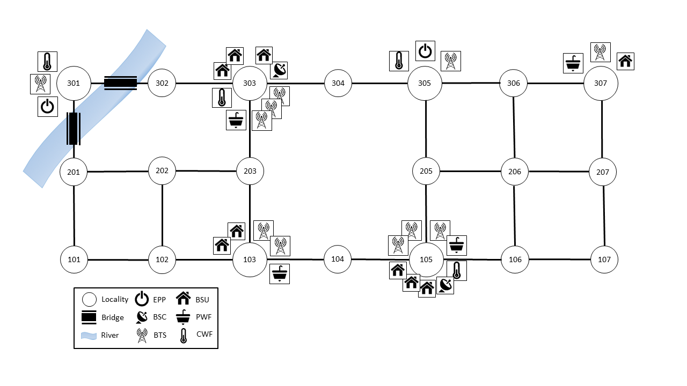

Example 2
=========

Example 2 shows how **pyrecodes** can be used to assess the resilience of interdependent infrastructure systems and housing in a virtual community affected by a scenario disaster. This is a toy example to illustrate how system recovery is simulated following a disaster and how component interdependencies are captured in iRe-CoDeS.



        Virtual community in Example 2.

Running the example
-------------------

Example 2 Jupyter notebook illustrates how to run the pyrecodes simulation and plot the post-disaster supply/demand/consumption dynamics and the components' recovery gantt chart.

.. Run the example online using `Google Colab <https://colab.research.google.com/github/NikolaBlagojevic/pyrecodes/blob/main/Example2_VirtualCommunity_Colab.ipynb>`_.
    
The example can be run locally by downloading the `Example 2 Jupyter notebook <https://github.com/NikolaBlagojevic/pyrecodes/blob/main/Example2_VirtualCommunity.ipynb>`_ and the required files from the `Example 2 folder <https://github.com/NikolaBlagojevic/pyrecodes/tree/main/Example%202>`_. 

Virtual community description
-----------------------------

Virtual community consists of the building stock and three interdependent infrastructure systems: the Electric Power Supply System, the Water Supply System and the Cellular Communication System. Community is discretized into 20 localities connected with links, containing components and/or representing link intersections. 

The Electric Power Supply System provides electric power produced by Electric Power Plants (EPPs) and transferred to users through the Transsmision Lines, represented as links between localities. 

The Water Supply System provides cooling and potable water to the community. The two resources are supplied by the Cooling Water Facilities (CWFs) and Potable Water Facilities (PWFs) and transferred by cooling water pipes and potable water pipes that have the same topology as the transmission lines, represents as black lines in the figure above.

The Cellular Communication System consists of Base Station Controllers (BSCs) that control Base Transceiver Stations (BTSs) by providing High Level Communication resource. The BTSs then provide Low Level Communication to the community.

The components are interdependent as they require resources provided by other systems to operate. The interdependencies are defined by the resource amounts components need to operate, as specified in the **component library** file.

Componets are assigned initial post-disaster damage levels as defined in the *example_2_damage_input.txt* in the Example 2 folder. Such damage levels can be obtained using hazard and vulnerability models `[link] <https://www.research-collection.ethz.ch/bitstream/handle/20.500.11850/463555/1/7d-0003_Published.pdf>`_.

Component library
-----------------

In the following component templates used in Example 2 are presented. Please refer to Example 1 and the `How to use pyrecodes <./user_guide.html>`_ page for a more detailed description of the different sections in the component library.

Electric Power Plant
`````````````````````
.. toggle:: 

        .. code-block:: json

                "ElectricPowerPlant": {
                        "ComponentClass": {"FileName": "standard_irecodes_component", "ClassName": "StandardiReCoDeSComponent"},
                        "RecoveryModel": {
                                "FileName": "component_level_recovery_activities_model",
                                "ClassName": "ComponentLevelRecoveryActivitiesModel",
                                "Parameters": {
                                        "Repair": {
                                                "Duration": {
                                                        "Deterministic": {
                                                                "Value": 100
                                                        }
                                                }
                                        }
                                },
                                "DamageFunctionalityRelation": {
                                        "Type": "ReverseLinear"
                                }
                        },
                        "Supply": {
                                "ElectricPower": {
                                        "Amount": 40,
                                        "FunctionalityToAmountRelation": "Linear",
                                        "UnmetDemandToAmountRelation": "Binary"
                                }
                        },
                        "OperationDemand": {
                                "ElectricPower": {
                                        "Amount": 0.2,
                                        "FunctionalityToAmountRelation": "Constant"
                                },
                                "LowLevelCommunication": {
                                        "Amount": 0.001,
                                        "FunctionalityToAmountRelation": "Constant"
                                },
                                "CoolingWater": {
                                        "Amount": 0.05,
                                        "FunctionalityToAmountRelation": "Constant"
                                }
                        }
                }

Base Station Controller
`````````````````````````

.. toggle:: 

        .. code-block:: json

                "BaseStationController": {
                        "ComponentClass": {"FileName": "standard_irecodes_component", "ClassName": "StandardiReCoDeSComponent"},
                        "RecoveryModel": {
                                "FileName": "component_level_recovery_activities_model",
                                "ClassName": "ComponentLevelRecoveryActivitiesModel",
                                "Parameters": {
                                        "Repair": {
                                                "Duration": {"Deterministic": {"Value": 100}} 
                                                }       
                                        },
                                "DamageFunctionalityRelation": {
                                        "Type": "ReverseLinear"
                                        }
                                },       
                        "Supply": {
                                "HighLevelCommunication": {
                                        "Amount": 300,
                                        "FunctionalityToAmountRelation": "Linear",
                                        "UnmetDemandToAmountRelation": "Binary"
                                }
                        },
                        "OperationDemand": {
                                "ElectricPower": {
                                        "Amount": 0.2,
                                        "FunctionalityToAmountRelation": "Constant"                
                                },          
                                "CoolingWater": {
                                        "Amount": 0.05,
                                        "FunctionalityToAmountRelation": "Constant"                
                                }         
                        }
                }

Base Transceiver Station
`````````````````````````
.. toggle:: 

        .. code-block:: json
                
                "BaseTransceiverStation": {
                        "ComponentClass": {"FileName": "standard_irecodes_component", "ClassName": "StandardiReCoDeSComponent"},
                        "RecoveryModel": {
                                "FileName": "component_level_recovery_activities_model",
                                "ClassName": "ComponentLevelRecoveryActivitiesModel",
                                "Parameters": {
                                        "Repair": {
                                        "Duration": {
                                                "Deterministic": {
                                                        "Value": 20
                                                        }
                                                }   
                                        }                
                                },
                                "DamageFunctionalityRelation": {
                                        "Type": "ReverseBinary"
                                }
                        },       
                        "Supply": {
                                "LowLevelCommunication": {
                                        "Amount": 45,
                                        "FunctionalityToAmountRelation": "Linear",
                                        "UnmetDemandToAmountRelation": "Binary"
                                }
                        },
                        "OperationDemand": {
                                "ElectricPower": {
                                        "Amount": 0.1,
                                        "FunctionalityToAmountRelation": "Linear"                
                                },
                                "HighLevelCommunication": {
                                        "Amount": 50,
                                        "FunctionalityToAmountRelation": "Linear"                
                                }
                        }
                }

Potable Water Facility
```````````````````````

.. toggle:: 

        .. code-block:: json
                
                "PotableWaterFacility": {
                        "ComponentClass": {"FileName": "standard_irecodes_component", "ClassName": "StandardiReCoDeSComponent"},
                        "RecoveryModel": {
                                "FileName": "component_level_recovery_activities_model",
                                "ClassName": "ComponentLevelRecoveryActivitiesModel",
                                "Parameters": {
                                        "Repair": {
                                        "Duration": {
                                                "Deterministic": {
                                                "Value": 100
                                                        }
                                                }
                                        }
                                },
                                "DamageFunctionalityRelation": {
                                        "Type": "ReverseBinary"
                                }
                        },
                        "Supply": {
                                "PotableWater": {
                                        "Amount": 0.2,
                                        "FunctionalityToAmountRelation": "Linear",
                                        "UnmetDemandToAmountRelation": "Binary"
                                }
                        },
                        "OperationDemand": {            
                                "ElectricPower": {
                                        "Amount": 0.1,
                                        "FunctionalityToAmountRelation": "Constant"
                                }
                        }
                }

Cooling Water Facility
```````````````````````

.. toggle:: 

        .. code-block:: json

                "CoolingWaterFacility": {
                        "ComponentClass": {"FileName": "standard_irecodes_component", "ClassName": "StandardiReCoDeSComponent"},
                        "RecoveryModel": {
                                "FileName": "component_level_recovery_activities_model",
                                "ClassName": "ComponentLevelRecoveryActivitiesModel",
                                "Parameters": {
                                        "Repair": {
                                                "Duration": {
                                                        "Deterministic": {
                                                                "Value": 20
                                                                }
                                                        }
                                                }
                                        },
                                        "DamageFunctionalityRelation": {
                                                "Type": "ReverseLinear"
                                        }
                                },
                        "Supply": {
                                "CoolingWater": {
                                        "Amount": 0.06,
                                        "FunctionalityToAmountRelation": "Linear",
                                        "UnmetDemandToAmountRelation": "Binary"
                                }
                        },
                        "OperationDemand": {            
                                "ElectricPower": {
                                        "Amount": 0.2,
                                        "FunctionalityToAmountRelation": "Constant"
                                },
                                "LowLevelCommunication": {
                                        "Amount": 0.001,
                                        "FunctionalityToAmountRelation": "Constant"
                                }
                        }
                },

Building Stock Unit
```````````````````

.. toggle:: 

        .. code-block:: json

                "BuildingStockUnit": {
                        "ComponentClass": {"FileName": "building_with_emergency_calls", "ClassName": "BuildingWithEmergencyCalls"},
                        "RecoveryModel": {
                                "FileName": "component_level_recovery_activities_model",
                                "ClassName": "ComponentLevelRecoveryActivitiesModel",
                                "Parameters": {
                                        "Repair": {
                                                "Duration": {
                                                        "Deterministic": {
                                                                "Value": 100
                                                        }
                                                }
                                        }
                                },
                                "DamageFunctionalityRelation": {
                                        "Type": "ReverseLinear"
                                }
                        },
                        "Supply": {
                                "Shelter": {
                                        "Amount": 400,
                                        "FunctionalityToAmountRelation": "Linear",
                                        "UnmetDemandToAmountRelation": "Constant"
                                },
                                "FunctionalHousing": {
                                        "Amount": 400,
                                        "FunctionalityToAmountRelation": "Linear",
                                        "UnmetDemandToAmountRelation": "Linear"
                                }
                        },
                        "OperationDemand": {
                                "ElectricPower": {
                                        "Amount": 7.7,
                                        "FunctionalityToAmountRelation": "Linear"
                                },
                                "LowLevelCommunication": {
                                        "Amount": 33.3,
                                        "FunctionalityToAmountRelation": "Constant",
                                        "PostDisasterIncreaseDueToEmergencyCalls": "True"
                                },
                                "PotableWater": {
                                        "Amount": 0.086,
                                        "FunctionalityToAmountRelation": "Linear"
                                },
                                "Shelter": {
                                        "Amount": 400,
                                        "FunctionalityToAmountRelation": "Constant"            
                                },
                                "FunctionalHousing": {
                                        "Amount": 400,
                                        "FunctionalityToAmountRelation": "Constant"           
                                }              
                        }
                },

Electric Power Transmission Line
`````````````````````````````````

.. toggle::

        .. code-block:: json

                "ElectricPowerTransmissionLine": {
                        "ComponentClass": {"FileName": "standard_irecodes_component", "ClassName": "StandardiReCoDeSComponent"},
                        "RecoveryModel": {
                                "FileName": "component_level_recovery_activities_model",
                                "ClassName": "ComponentLevelRecoveryActivitiesModel",
                                "Parameters": {
                                        "Repair": {
                                                "Duration": {
                                                        "Deterministic": {
                                                                "Value": 20
                                                                }
                                                        }
                                                }
                                        },
                                "DamageFunctionalityRelation": {
                                        "Type": "ReverseLinear"
                                }
                        },
                        "Supply": {
                                "ElectricPowerTransferService": {
                                        "Amount": 1000,
                                        "FunctionalityToAmountRelation": "Linear",
                                        "UnmetDemandToAmountRelation": "Constant"
                                }
                        }   
                        "OperationDemand": {
                                "BridgeService": {
                                        "Amount": 1,
                                        "FunctionalityToAmountRelation": "Constant"
                                }
                        }
                }

Potable Water Pipe
```````````````````

.. toggle::

        .. code-block:: json

                "PotableWaterPipe": {
                        "ComponentClass": {"FileName": "standard_irecodes_component", "ClassName": "StandardiReCoDeSComponent"},
                        "RecoveryModel": {
                                "FileName": "component_level_recovery_activities_model",
                                "ClassName": "ComponentLevelRecoveryActivitiesModel",
                                "Parameters": {
                                        "Repair": {
                                                "Duration": {
                                                        "Deterministic": {
                                                                "Value": 20
                                                        }
                                                }
                                        }
                                },
                                "DamageFunctionalityRelation": {
                                        "Type": "ReverseLinear"
                                }
                        },
                        "Supply": {
                                "PotableWaterTransferService": {
                                        "Amount": 1000,
                                        "FunctionalityToAmountRelation": "Linear",
                                        "UnmetDemandToAmountRelation": "Constant"
                                }
                        }   
                        "OperationDemand": {
                                "BridgeService": {
                                        "Amount": 1,
                                        "FunctionalityToAmountRelation": "Constant"
                                }
                        }
                }

Cooling Water Pipe
```````````````````

.. toggle::

        .. code-block:: json
     
                "CoolingWaterPipe": {
                        "ComponentClass": {"FileName": "standard_irecodes_component", "ClassName": "StandardiReCoDeSComponent"},
                        "RecoveryModel": {
                                "FileName": "component_level_recovery_activities_model",
                                "ClassName": "ComponentLevelRecoveryActivitiesModel",
                                "Parameters": {
                                        "Repair": {
                                        "Duration": {
                                                "Deterministic": {
                                                        "Value": 20
                                                        }
                                                }
                                        }
                                },
                                "DamageFunctionalityRelation": {
                                        "Type": "ReverseLinear"
                                }
                        },
                        "Supply": {
                                "CoolingWaterTransferService": {
                                        "Amount": 1000,
                                        "FunctionalityToAmountRelation": "Linear",
                                        "UnmetDemandToAmountRelation": "Binary"
                                }
                        },
                        "OperationDemand": {
                                "BridgeService": {
                                        "Amount": 1,
                                        "FunctionalityToAmountRelation": "Constant"
                                }
                        }
                }

Bridge
```````

.. toggle::

        .. code-block:: json

                "Bridge": {
                        "ComponentClass": {"FileName": "standard_irecodes_component", "ClassName": "StandardiReCoDeSComponent"},
                        "RecoveryModel": {
                                "FileName": "component_level_recovery_activities_model",
                                "ClassName": "ComponentLevelRecoveryActivitiesModel",
                                "Parameters": {
                                        "Repair": {
                                        "Duration": {
                                                "Deterministic": {
                                                "Value": 100
                                                }
                                        }
                                        }
                                },
                                "DamageFunctionalityRelation": {
                                        "Type": "ReverseLinear"
                                }
                        },
                        "Supply": {
                                "BridgeService": {
                                        "Amount": 1,
                                        "FunctionalityToAmountRelation": "Linear",
                                        "UnmetDemandToAmountRelation": "Constant"
                                }
                        }
                }
                

System configuration
--------------------

Sections of the system configuration file for Example 2 are presented next. Please refer to Example 1 and the `How to use pyrecodes <./user_guide.html>`_ page for an in-depth explanation of system configuration file sections.

Constants
`````````

.. toggle::

        .. code-block:: json

                "Constants": {
                        "START_TIME_STEP": 0,
                        "MAX_TIME_STEP": 500,
                        "DISASTER_TIME_STEP": 1
                }

Content
```````

.. toggle::

        .. code-block:: json

                "Content": {
                        "Locality 101": {
                                "Coordinates": {
                                        "X": 1,
                                        "Y": 1
                                },
                                "Components": {
                                        "Infrastructure": [
                                        {"ElectricPowerSystem": {
                                                "CreatorClassName": "JSONSubsystemCreator",
                                                "CreatorFileName": "json_subsystem_creator",
                                                "Parameters": {
                                                "ComponentsBetweenLocalities": {
                                                        "Locality 201": ["ElectricPowerTransmissionLine"],
                                                        "Locality 102": ["ElectricPowerTransmissionLine"]
                                                }
                                                }
                                        }},
                                        {"PotableWaterSystem": {
                                                "CreatorClassName": "JSONSubsystemCreator",
                                                "CreatorFileName": "json_subsystem_creator",
                                                "Parameters": {
                                                "ComponentsBetweenLocalities": {
                                                        "Locality 201": ["PotableWaterPipe"],
                                                        "Locality 102": ["PotableWaterPipe"]
                                                }
                                                }
                                        }},
                                        {
                                        "CoolingWaterSystem": {
                                                "CreatorClassName": "JSONSubsystemCreator",
                                                "CreatorFileName": "json_subsystem_creator",
                                                "Parameters": {
                                                "ComponentsBetweenLocalities": {
                                                        "Locality 201": ["CoolingWaterPipe"],
                                                        "Locality 102": ["CoolingWaterPipe"]
                                                }
                                                }
                                        }
                                        }
                                        ]
                                }
                                },
                        "Locality 102": {
                                "Coordinates": {
                                        "X": 2,
                                        "Y": 1
                                },
                                "Components": {
                                        "Infrastructure": [
                                                {"ElectricPowerSystem": {
                                                "CreatorClassName": "JSONSubsystemCreator",
                                                "CreatorFileName": "json_subsystem_creator",
                                                "Parameters": {
                                                        "ComponentsBetweenLocalities": {
                                                        "Locality 101": ["ElectricPowerTransmissionLine"],
                                                        "Locality 202": ["ElectricPowerTransmissionLine"],
                                                        "Locality 103": ["ElectricPowerTransmissionLine"]
                                                        }
                                                }
                                                }},
                                                {"PotableWaterSystem": {
                                                "CreatorClassName": "JSONSubsystemCreator",
                                                "CreatorFileName": "json_subsystem_creator",
                                                "Parameters": {
                                                        "ComponentsBetweenLocalities": {
                                                        "Locality 101": ["PotableWaterPipe"],
                                                        "Locality 202": ["PotableWaterPipe"],
                                                        "Locality 103": ["PotableWaterPipe"]
                                                        }
                                                }
                                                }},
                                                {
                                                "CoolingWaterSystem": {
                                                "CreatorClassName": "JSONSubsystemCreator",
                                                "CreatorFileName": "json_subsystem_creator",
                                                "Parameters": {
                                                        "ComponentsBetweenLocalities": {
                                                        "Locality 101": ["CoolingWaterPipe"],
                                                        "Locality 202": ["CoolingWaterPipe"],
                                                        "Locality 103": ["CoolingWaterPipe"]
                                                        }
                                                }
                                                }
                                                }
                                        ]
                                        }
                                },
                        "Locality 103": {
                                "Coordinates": {
                                        "X": 3,
                                        "Y": 1
                                },
                                "Components":{
                                        "Infrastructure": [
                                                {"ElectricPowerSystem": {
                                                "CreatorClassName": "JSONSubsystemCreator",
                                                "CreatorFileName": "json_subsystem_creator",
                                                "Parameters": {
                                                        "ComponentsBetweenLocalities": {
                                                        "Locality 102": ["ElectricPowerTransmissionLine"],
                                                        "Locality 203": ["ElectricPowerTransmissionLine"],
                                                        "Locality 104": ["ElectricPowerTransmissionLine"]
                                                        }
                                                }
                                                }},
                                                {"PotableWaterSystem": {
                                                "CreatorClassName": "JSONSubsystemCreator",
                                                "CreatorFileName": "json_subsystem_creator",
                                                "Parameters": {
                                                        "ComponentsInLocality": {
                                                        "PotableWaterFacility": 1
                                                        },
                                                        "ComponentsBetweenLocalities": {
                                                        "Locality 102": ["PotableWaterPipe"],
                                                        "Locality 203": ["PotableWaterPipe"],
                                                        "Locality 104": ["PotableWaterPipe"]
                                                        }
                                                }
                                                }},
                                                {
                                                "CoolingWaterSystem": {
                                                "CreatorClassName": "JSONSubsystemCreator",
                                                "CreatorFileName": "json_subsystem_creator",
                                                "Parameters": {
                                                        "ComponentsBetweenLocalities": {
                                                        "Locality 102": ["CoolingWaterPipe"],
                                                        "Locality 203": ["CoolingWaterPipe"],
                                                        "Locality 104": ["CoolingWaterPipe"]
                                                        }
                                                }
                                                }
                                                },
                                                {
                                                "CommunicationSystem": {
                                                        "CreatorClassName": "JSONSubsystemCreator",
                                                        "CreatorFileName": "json_subsystem_creator",
                                                        "Parameters": {
                                                        "ComponentsInLocality": {
                                                                "BaseTransceiverStation": 2
                                                        }
                                                        }
                                                }
                                                }
                                        ],
                                        "BuildingStock": [
                                        {"Buildings": {
                                                "CreatorClassName": "JSONSubsystemCreator",
                                                "CreatorFileName": "json_subsystem_creator",
                                                "Parameters": {
                                                "ComponentsInLocality": {
                                                        "BuildingStockUnit": 2
                                                }
                                                }
                                        }}
                                        ]
                                }
                                },
                        "Locality 104": {
                                "Coordinates": {
                                        "X": 4,
                                        "Y": 1
                                },
                                "Components": {
                                        "Infrastructure": [
                                                {"ElectricPowerSystem": {
                                                "CreatorClassName": "JSONSubsystemCreator",
                                                "CreatorFileName": "json_subsystem_creator",
                                                "Parameters": {
                                                        "ComponentsBetweenLocalities": {
                                                        "Locality 103": ["ElectricPowerTransmissionLine"],
                                                        "Locality 105": ["ElectricPowerTransmissionLine"]
                                                        }
                                                }
                                                }},
                                                {"PotableWaterSystem": {
                                                "CreatorClassName": "JSONSubsystemCreator",
                                                "CreatorFileName": "json_subsystem_creator",
                                                "Parameters": {
                                                        "ComponentsBetweenLocalities": {
                                                        "Locality 103": ["PotableWaterPipe"],
                                                        "Locality 105": ["PotableWaterPipe"]
                                                        }
                                                }
                                                }},
                                                {
                                                "CoolingWaterSystem": {
                                                "CreatorClassName": "JSONSubsystemCreator",
                                                "CreatorFileName": "json_subsystem_creator",
                                                "Parameters": {
                                                        "ComponentsBetweenLocalities": {
                                                        "Locality 103": ["CoolingWaterPipe"],
                                                        "Locality 105": ["CoolingWaterPipe"]
                                                        }
                                                }
                                                }
                                                }
                                        ]
                                }
                                },
                        "Locality 105": {
                                "Coordinates": {
                                        "X": 5,
                                        "Y": 1
                                },
                                "Components":{
                                        "Infrastructure": [
                                                {"ElectricPowerSystem": {
                                                "CreatorClassName": "JSONSubsystemCreator",
                                                "CreatorFileName": "json_subsystem_creator",
                                                "Parameters": {
                                                        "ComponentsBetweenLocalities": {
                                                        "Locality 104": ["ElectricPowerTransmissionLine"],
                                                        "Locality 205": ["ElectricPowerTransmissionLine"],
                                                        "Locality 106": ["ElectricPowerTransmissionLine"]
                                                        }
                                                }
                                                }},
                                                {"PotableWaterSystem": {
                                                "CreatorClassName": "JSONSubsystemCreator",
                                                "CreatorFileName": "json_subsystem_creator",
                                                "Parameters": {
                                                        "ComponentsInLocality": {
                                                        "PotableWaterFacility": 1
                                                        },
                                                        "ComponentsBetweenLocalities": {
                                                        "Locality 104": ["PotableWaterPipe"],
                                                        "Locality 205": ["PotableWaterPipe"],
                                                        "Locality 106": ["PotableWaterPipe"]
                                                        }
                                                }
                                                }},
                                                {
                                                "CoolingWaterSystem": {
                                                "CreatorClassName": "JSONSubsystemCreator",
                                                "CreatorFileName": "json_subsystem_creator",
                                                "Parameters": {
                                                        "ComponentsInLocality": {
                                                        "CoolingWaterFacility": 1
                                                        },
                                                        "ComponentsBetweenLocalities": {
                                                        "Locality 104": ["CoolingWaterPipe"],
                                                        "Locality 205": ["CoolingWaterPipe"],
                                                        "Locality 106": ["CoolingWaterPipe"]
                                                        }
                                                }
                                                }
                                                },
                                                {
                                                "CommunicationSystem": {
                                                        "CreatorClassName": "JSONSubsystemCreator",
                                                        "CreatorFileName": "json_subsystem_creator",
                                                        "Parameters": {
                                                        "ComponentsInLocality": {
                                                                "BaseTransceiverStation": 3,
                                                                "BaseStationController": 1
                                                        }
                                                        }
                                                }
                                                }
                                        ],
                                        "BuildingStock": [
                                        {"Buildings": {
                                                "CreatorClassName": "JSONSubsystemCreator",
                                                "CreatorFileName": "json_subsystem_creator",
                                                "Parameters": {
                                                "ComponentsInLocality": {
                                                        "BuildingStockUnit": 3
                                                }
                                                }
                                        }}
                                        ]
                                }
                                },
                        "Locality 106": {
                                "Coordinates": {
                                        "X": 6,
                                        "Y": 1
                                },
                                "Components":{
                                        "Infrastructure": [
                                                {"ElectricPowerSystem": {
                                                "CreatorClassName": "JSONSubsystemCreator",
                                                "CreatorFileName": "json_subsystem_creator",
                                                "Parameters": {
                                                        "ComponentsBetweenLocalities": {
                                                        "Locality 105": ["ElectricPowerTransmissionLine"],
                                                        "Locality 206": ["ElectricPowerTransmissionLine"],
                                                        "Locality 107": ["ElectricPowerTransmissionLine"]
                                                        }
                                                }
                                                }},
                                                {"PotableWaterSystem": {
                                                "CreatorClassName": "JSONSubsystemCreator",
                                                "CreatorFileName": "json_subsystem_creator",
                                                "Parameters": {
                                                        "ComponentsBetweenLocalities": {
                                                        "Locality 105": ["PotableWaterPipe"],
                                                        "Locality 206": ["PotableWaterPipe"],
                                                        "Locality 107": ["PotableWaterPipe"]
                                                        }
                                                }
                                                }},
                                                {
                                                "CoolingWaterSystem": {
                                                "CreatorClassName": "JSONSubsystemCreator",
                                                "CreatorFileName": "json_subsystem_creator",
                                                "Parameters": {
                                                        "ComponentsBetweenLocalities": {
                                                        "Locality 105": ["CoolingWaterPipe"],
                                                        "Locality 206": ["CoolingWaterPipe"],
                                                        "Locality 107": ["CoolingWaterPipe"]
                                                        }
                                                }
                                                }
                                                }
                                        ]
                                }
                                },
                        "Locality 107": {
                                "Coordinates": {
                                        "X": 7,
                                        "Y": 1
                                },
                                "Components":{
                                        "Infrastructure": [
                                                {"ElectricPowerSystem": {
                                                "CreatorClassName": "JSONSubsystemCreator",
                                                "CreatorFileName": "json_subsystem_creator",
                                                "Parameters": {
                                                        "ComponentsBetweenLocalities": {
                                                        "Locality 106": ["ElectricPowerTransmissionLine"],
                                                        "Locality 207": ["ElectricPowerTransmissionLine"]
                                                        }
                                                }
                                                }},
                                                {"PotableWaterSystem": {
                                                "CreatorClassName": "JSONSubsystemCreator",
                                                "CreatorFileName": "json_subsystem_creator",
                                                "Parameters": {
                                                        "ComponentsBetweenLocalities": {
                                                        "Locality 106": ["PotableWaterPipe"],
                                                        "Locality 207": ["PotableWaterPipe"]
                                                        }
                                                }
                                                }},
                                                {
                                                "CoolingWaterSystem": {
                                                "CreatorClassName": "JSONSubsystemCreator",
                                                "CreatorFileName": "json_subsystem_creator",
                                                "Parameters": {
                                                        "ComponentsBetweenLocalities": {
                                                        "Locality 106": ["CoolingWaterPipe"],
                                                        "Locality 207": ["CoolingWaterPipe"]
                                                        }
                                                }
                                                }
                                                }
                                        ]
                                }
                                },
                        "Locality 201": {
                                "Coordinates": {
                                        "X": 1,
                                        "Y": 2
                                },
                                "Components":{
                                        "Infrastructure": [
                                                {"ElectricPowerSystem": {
                                                "CreatorClassName": "JSONSubsystemCreator",
                                                "CreatorFileName": "json_subsystem_creator",
                                                "Parameters": {
                                                        "ComponentsBetweenLocalities": {
                                                        "Locality 101": ["ElectricPowerTransmissionLine"],
                                                        "Locality 202": ["ElectricPowerTransmissionLine"],
                                                        "Locality 301": ["ElectricPowerTransmissionLine"]
                                                        }
                                                }
                                                }},
                                                {"PotableWaterSystem": {
                                                "CreatorClassName": "JSONSubsystemCreator",
                                                "CreatorFileName": "json_subsystem_creator",
                                                "Parameters": {
                                                        "ComponentsBetweenLocalities": {
                                                        "Locality 101": ["PotableWaterPipe"],
                                                        "Locality 202": ["PotableWaterPipe"],
                                                        "Locality 301": ["PotableWaterPipe"]
                                                        }
                                                }
                                                }},
                                                {
                                                "CoolingWaterSystem": {
                                                "CreatorClassName": "JSONSubsystemCreator",
                                                "CreatorFileName": "json_subsystem_creator",
                                                "Parameters": {
                                                        "ComponentsBetweenLocalities": {
                                                        "Locality 101": ["CoolingWaterPipe"],
                                                        "Locality 202": ["CoolingWaterPipe"],
                                                        "Locality 301": ["CoolingWaterPipe"]
                                                        }
                                                }
                                                }
                                                },
                                                {
                                                "TransportationSystem": {
                                                "CreatorClassName": "JSONSubsystemCreator",
                                                "CreatorFileName": "json_subsystem_creator",
                                                "Parameters": {
                                                        "ComponentsBetweenLocalities": {
                                                        "Locality 301": ["Bridge"]
                                                        }
                                                }
                                                }
                                                }
                                        ]
                                }
                                },
                        "Locality 202": {
                                "Coordinates": {
                                        "X": 2,
                                        "Y": 2
                                },
                                "Components":{
                                        "Infrastructure": [
                                                {"ElectricPowerSystem": {
                                                "CreatorClassName": "JSONSubsystemCreator",
                                                "CreatorFileName": "json_subsystem_creator",
                                                "Parameters": {
                                                        "ComponentsBetweenLocalities": {
                                                        "Locality 201": ["ElectricPowerTransmissionLine"],
                                                        "Locality 203": ["ElectricPowerTransmissionLine"],
                                                        "Locality 102": ["ElectricPowerTransmissionLine"]
                                                        }
                                                }
                                                }},
                                                {"PotableWaterSystem": {
                                                "CreatorClassName": "JSONSubsystemCreator",
                                                "CreatorFileName": "json_subsystem_creator",
                                                "Parameters": {
                                                        "ComponentsBetweenLocalities": {
                                                        "Locality 201": ["PotableWaterPipe"],
                                                        "Locality 203": ["PotableWaterPipe"],
                                                        "Locality 102": ["PotableWaterPipe"]
                                                        }
                                                }
                                                }},
                                                {
                                                "CoolingWaterSystem": {
                                                "CreatorClassName": "JSONSubsystemCreator",
                                                "CreatorFileName": "json_subsystem_creator",
                                                "Parameters": {
                                                        "ComponentsBetweenLocalities": {
                                                        "Locality 201": ["CoolingWaterPipe"],
                                                        "Locality 203": ["CoolingWaterPipe"],
                                                        "Locality 102": ["CoolingWaterPipe"]
                                                        }
                                                }
                                                }
                                                }
                                        ]
                                }
                                },
                        "Locality 203": {
                                "Coordinates": {
                                        "X": 3,
                                        "Y": 2
                                },
                                "Components":{
                                        "Infrastructure": [
                                                {"ElectricPowerSystem": {
                                                "CreatorClassName": "JSONSubsystemCreator",
                                                "CreatorFileName": "json_subsystem_creator",
                                                "Parameters": {
                                                        "ComponentsBetweenLocalities": {
                                                        "Locality 202": ["ElectricPowerTransmissionLine"],
                                                        "Locality 103": ["ElectricPowerTransmissionLine"],
                                                        "Locality 303": ["ElectricPowerTransmissionLine"]
                                                        }
                                                }
                                                }},
                                                {"PotableWaterSystem": {
                                                "CreatorClassName": "JSONSubsystemCreator",
                                                "CreatorFileName": "json_subsystem_creator",
                                                "Parameters": {
                                                        "ComponentsBetweenLocalities": {
                                                        "Locality 202": ["PotableWaterPipe"],
                                                        "Locality 103": ["PotableWaterPipe"],
                                                        "Locality 303": ["PotableWaterPipe"]
                                                        }
                                                }
                                                }},
                                                {
                                                "CoolingWaterSystem": {
                                                "CreatorClassName": "JSONSubsystemCreator",
                                                "CreatorFileName": "json_subsystem_creator",
                                                "Parameters": {
                                                        "ComponentsBetweenLocalities": {
                                                        "Locality 202": ["CoolingWaterPipe"],
                                                        "Locality 103": ["CoolingWaterPipe"],
                                                        "Locality 303": ["CoolingWaterPipe"]
                                                        }
                                                }
                                                }
                                                }
                                        ]
                                }
                                },
                        "Locality 205": {
                                "Coordinates": {
                                        "X": 5,
                                        "Y": 2
                                },
                                "Components":{
                                        "Infrastructure": [
                                                {"ElectricPowerSystem": {
                                                "CreatorClassName": "JSONSubsystemCreator",
                                                "CreatorFileName": "json_subsystem_creator",
                                                "Parameters": {
                                                        "ComponentsBetweenLocalities": {
                                                        "Locality 105": ["ElectricPowerTransmissionLine"],
                                                        "Locality 206": ["ElectricPowerTransmissionLine"],
                                                        "Locality 305": ["ElectricPowerTransmissionLine"]
                                                        }
                                                }
                                                }},
                                                {"PotableWaterSystem": {
                                                "CreatorClassName": "JSONSubsystemCreator",
                                                "CreatorFileName": "json_subsystem_creator",
                                                "Parameters": {
                                                        "ComponentsBetweenLocalities": {
                                                        "Locality 105": ["PotableWaterPipe"],
                                                        "Locality 206": ["PotableWaterPipe"],
                                                        "Locality 305": ["PotableWaterPipe"]
                                                        }
                                                }
                                                }},
                                                {
                                                "CoolingWaterSystem": {
                                                "CreatorClassName": "JSONSubsystemCreator",
                                                "CreatorFileName": "json_subsystem_creator",
                                                "Parameters": {
                                                        "ComponentsBetweenLocalities": {
                                                        "Locality 105": ["CoolingWaterPipe"],
                                                        "Locality 206": ["CoolingWaterPipe"],
                                                        "Locality 305": ["CoolingWaterPipe"]
                                                        }
                                                }
                                                }
                                                }
                                        ]
                                }
                                },
                        "Locality 206": {
                                "Coordinates": {
                                        "X": 6,
                                        "Y": 2
                                },
                                "Components":{
                                        "Infrastructure": [
                                                {"ElectricPowerSystem": {
                                                "CreatorClassName": "JSONSubsystemCreator",
                                                "CreatorFileName": "json_subsystem_creator",
                                                "Parameters": {
                                                        "ComponentsBetweenLocalities": {
                                                        "Locality 106": ["ElectricPowerTransmissionLine"],
                                                        "Locality 205": ["ElectricPowerTransmissionLine"],
                                                        "Locality 306": ["ElectricPowerTransmissionLine"],
                                                        "Locality 207": ["ElectricPowerTransmissionLine"]
                                                        }
                                                }
                                                }},
                                                {"PotableWaterSystem": {
                                                "CreatorClassName": "JSONSubsystemCreator",
                                                "CreatorFileName": "json_subsystem_creator",
                                                "Parameters": {
                                                        "ComponentsBetweenLocalities": {
                                                        "Locality 106": ["PotableWaterPipe"],
                                                        "Locality 205": ["PotableWaterPipe"],
                                                        "Locality 306": ["PotableWaterPipe"],
                                                        "Locality 207": ["PotableWaterPipe"]
                                                        }
                                                }
                                                }},
                                                {
                                                "CoolingWaterSystem": {
                                                "CreatorClassName": "JSONSubsystemCreator",
                                                "CreatorFileName": "json_subsystem_creator",
                                                "Parameters": {
                                                        "ComponentsBetweenLocalities": {
                                                        "Locality 106": ["CoolingWaterPipe"],
                                                        "Locality 205": ["CoolingWaterPipe"],
                                                        "Locality 306": ["CoolingWaterPipe"],
                                                        "Locality 207": ["CoolingWaterPipe"]
                                                        }
                                                }
                                                }
                                                }
                                        ]
                                }
                                },
                        "Locality 207": {
                                "Coordinates": {
                                        "X": 7,
                                        "Y": 2
                                },
                                "Components":{
                                        "Infrastructure": [
                                                {"ElectricPowerSystem": {
                                                "CreatorClassName": "JSONSubsystemCreator",
                                                "CreatorFileName": "json_subsystem_creator",
                                                "Parameters": {
                                                        "ComponentsBetweenLocalities": {
                                                        "Locality 107": ["ElectricPowerTransmissionLine"],
                                                        "Locality 206": ["ElectricPowerTransmissionLine"],
                                                        "Locality 307": ["ElectricPowerTransmissionLine"]
                                                        }
                                                }
                                                }},
                                                {"PotableWaterSystem": {
                                                "CreatorClassName": "JSONSubsystemCreator",
                                                "CreatorFileName": "json_subsystem_creator",
                                                "Parameters": {
                                                        "ComponentsBetweenLocalities": {
                                                        "Locality 107": ["PotableWaterPipe"],
                                                        "Locality 206": ["PotableWaterPipe"],
                                                        "Locality 307": ["PotableWaterPipe"]
                                                        }
                                                }
                                                }},
                                                {
                                                "CoolingWaterSystem": {
                                                "CreatorClassName": "JSONSubsystemCreator",
                                                "CreatorFileName": "json_subsystem_creator",
                                                "Parameters": {
                                                        "ComponentsBetweenLocalities": {
                                                        "Locality 107": ["CoolingWaterPipe"],
                                                        "Locality 206": ["CoolingWaterPipe"],
                                                        "Locality 307": ["CoolingWaterPipe"]
                                                        }
                                                }
                                                }
                                                }
                                        ]
                                }
                                },
                        "Locality 301": {
                                "Coordinates": {
                                        "X": 1,
                                        "Y": 3
                                },
                                "Components":{
                                        "Infrastructure": [
                                                {"ElectricPowerSystem": {
                                                "CreatorClassName": "JSONSubsystemCreator",
                                                "CreatorFileName": "json_subsystem_creator",
                                                "Parameters": {
                                                        "ComponentsInLocality": {
                                                        "ElectricPowerPlant": 1
                                                        },
                                                        "ComponentsBetweenLocalities": {
                                                        "Locality 201": ["ElectricPowerTransmissionLine"],
                                                        "Locality 302": ["ElectricPowerTransmissionLine"]
                                                        }
                                                }
                                                }},
                                                {"PotableWaterSystem": {
                                                "CreatorClassName": "JSONSubsystemCreator",
                                                "CreatorFileName": "json_subsystem_creator",
                                                "Parameters": {
                                                        "ComponentsBetweenLocalities": {
                                                        "Locality 201": ["PotableWaterPipe"],
                                                        "Locality 302": ["PotableWaterPipe"]
                                                        }
                                                }
                                                }},
                                                {
                                                "CoolingWaterSystem": {
                                                "CreatorClassName": "JSONSubsystemCreator",
                                                "CreatorFileName": "json_subsystem_creator",
                                                "Parameters": {
                                                        "ComponentsInLocality": {
                                                        "CoolingWaterFacility": 1
                                                        },
                                                        "ComponentsBetweenLocalities": {
                                                        "Locality 201": ["CoolingWaterPipe"],
                                                        "Locality 302": ["CoolingWaterPipe"]
                                                        }
                                                }
                                                }
                                                },
                                                {
                                                "CommunicationSystem": {
                                                "CreatorClassName": "JSONSubsystemCreator",
                                                "CreatorFileName": "json_subsystem_creator",
                                                "Parameters": {
                                                        "ComponentsInLocality": {
                                                        "BaseTransceiverStation": 1
                                                        }
                                                }
                                                }
                                                },
                                                {
                                                "TransportationSystem": {
                                                "CreatorClassName": "JSONSubsystemCreator",
                                                "CreatorFileName": "json_subsystem_creator",
                                                "Parameters": {
                                                        "ComponentsBetweenLocalities": {
                                                        "Locality 201": ["Bridge"],
                                                        "Locality 302": ["Bridge"]
                                                        }
                                                }
                                                }
                                                }
                                        ]
                                }
                                },
                        "Locality 302": {
                                "Coordinates": {
                                        "X": 2,
                                        "Y": 3
                                },
                                "Components":{
                                        "Infrastructure": [
                                                {"ElectricPowerSystem": {
                                                "CreatorClassName": "JSONSubsystemCreator",
                                                "CreatorFileName": "json_subsystem_creator",
                                                "Parameters": {
                                                        "ComponentsBetweenLocalities": {
                                                        "Locality 301": ["ElectricPowerTransmissionLine"],
                                                        "Locality 303": ["ElectricPowerTransmissionLine"]
                                                        }
                                                }
                                                }},
                                                {"PotableWaterSystem": {
                                                "CreatorClassName": "JSONSubsystemCreator",
                                                "CreatorFileName": "json_subsystem_creator",
                                                "Parameters": {
                                                        "ComponentsBetweenLocalities": {
                                                        "Locality 301": ["PotableWaterPipe"],
                                                        "Locality 303": ["PotableWaterPipe"]
                                                        }
                                                }
                                                }},
                                                {
                                                "CoolingWaterSystem": {
                                                "CreatorClassName": "JSONSubsystemCreator",
                                                "CreatorFileName": "json_subsystem_creator",
                                                "Parameters": {
                                                        "ComponentsBetweenLocalities": {
                                                        "Locality 301": ["CoolingWaterPipe"],
                                                        "Locality 303": ["CoolingWaterPipe"]
                                                        }
                                                }
                                                }
                                                },
                                                {
                                                "TransportationSystem": {
                                                "CreatorClassName": "JSONSubsystemCreator",
                                                "CreatorFileName": "json_subsystem_creator",
                                                "Parameters": {
                                                        "ComponentsBetweenLocalities": {
                                                        "Locality 301": ["Bridge"]
                                                        }
                                                }
                                                }
                                                }
                                        ]
                                }
                                },
                        "Locality 303": {
                                "Coordinates": {
                                        "X": 3,
                                        "Y": 3
                                },
                                "Components":{
                                        "Infrastructure": [
                                                {"ElectricPowerSystem": {
                                                "CreatorClassName": "JSONSubsystemCreator",
                                                "CreatorFileName": "json_subsystem_creator",
                                                "Parameters": {
                                                        "ComponentsBetweenLocalities": {
                                                        "Locality 302": ["ElectricPowerTransmissionLine"],
                                                        "Locality 203": ["ElectricPowerTransmissionLine"],
                                                        "Locality 304": ["ElectricPowerTransmissionLine"]
                                                        }
                                                }
                                                }},
                                                {"PotableWaterSystem": {
                                                "CreatorClassName": "JSONSubsystemCreator",
                                                "CreatorFileName": "json_subsystem_creator",
                                                "Parameters": {
                                                        "ComponentsInLocality": {
                                                        "PotableWaterFacility": 1
                                                        },
                                                        "ComponentsBetweenLocalities": {
                                                        "Locality 302": ["PotableWaterPipe"],
                                                        "Locality 203": ["PotableWaterPipe"],
                                                        "Locality 304": ["PotableWaterPipe"]
                                                        }
                                                }
                                                }},
                                                {
                                                "CoolingWaterSystem": {
                                                "CreatorClassName": "JSONSubsystemCreator",
                                                "CreatorFileName": "json_subsystem_creator",
                                                "Parameters": {
                                                        "ComponentsInLocality": {
                                                        "CoolingWaterFacility": 1
                                                        },
                                                        "ComponentsBetweenLocalities": {
                                                        "Locality 302": ["CoolingWaterPipe"],
                                                        "Locality 203": ["CoolingWaterPipe"],
                                                        "Locality 304": ["CoolingWaterPipe"]
                                                        }
                                                }
                                                }
                                                },
                                                {
                                                "CommunicationSystem": {
                                                "CreatorClassName": "JSONSubsystemCreator",
                                                "CreatorFileName": "json_subsystem_creator",
                                                "Parameters": {
                                                        "ComponentsInLocality": {
                                                        "BaseTransceiverStation": 3,
                                                        "BaseStationController": 1
                                                        }
                                                }
                                                }
                                                }
                                        ],
                                        "BuildingStock": [
                                        {"Buildings": {
                                                "CreatorClassName": "JSONSubsystemCreator",
                                                "CreatorFileName": "json_subsystem_creator",
                                                "Parameters": {
                                                "ComponentsInLocality": {
                                                        "BuildingStockUnit": 3
                                                }
                                                }
                                        }}
                                        ]
                                }
                                },
                        "Locality 304": {
                                "Coordinates": {
                                        "X": 4,
                                        "Y": 3
                                },
                                "Components":{
                                        "Infrastructure": [
                                                {"ElectricPowerSystem": {
                                                "CreatorClassName": "JSONSubsystemCreator",
                                                "CreatorFileName": "json_subsystem_creator",
                                                "Parameters": {
                                                        "ComponentsBetweenLocalities": {
                                                        "Locality 303": ["ElectricPowerTransmissionLine"],
                                                        "Locality 305": ["ElectricPowerTransmissionLine"]
                                                        }
                                                }
                                                }},
                                                {"PotableWaterSystem": {
                                                "CreatorClassName": "JSONSubsystemCreator",
                                                "CreatorFileName": "json_subsystem_creator",
                                                "Parameters": {
                                                        "ComponentsBetweenLocalities": {
                                                        "Locality 303": ["PotableWaterPipe"],
                                                        "Locality 305": ["PotableWaterPipe"]
                                                        }
                                                }
                                                }},
                                                {
                                                "CoolingWaterSystem": {
                                                "CreatorClassName": "JSONSubsystemCreator",
                                                "CreatorFileName": "json_subsystem_creator",
                                                "Parameters": {
                                                        "ComponentsBetweenLocalities": {
                                                        "Locality 303": ["CoolingWaterPipe"],
                                                        "Locality 305": ["CoolingWaterPipe"]
                                                        }
                                                }
                                                }
                                                }
                                        ]
                                }
                                },
                        "Locality 305": {
                                "Coordinates": {
                                        "X": 5,
                                        "Y": 3
                                },
                                "Components":{
                                        "Infrastructure": [
                                                {"ElectricPowerSystem": {
                                                "CreatorClassName": "JSONSubsystemCreator",
                                                "CreatorFileName": "json_subsystem_creator",
                                                "Parameters": {
                                                        "ComponentsInLocality": {
                                                        "ElectricPowerPlant": 1
                                                        },
                                                        "ComponentsBetweenLocalities": {
                                                        "Locality 302": ["ElectricPowerTransmissionLine"],
                                                        "Locality 203": ["ElectricPowerTransmissionLine"],
                                                        "Locality 304": ["ElectricPowerTransmissionLine"]
                                                        }
                                                }
                                                }},
                                                {"PotableWaterSystem": {
                                                "CreatorClassName": "JSONSubsystemCreator",
                                                "CreatorFileName": "json_subsystem_creator",
                                                "Parameters": {
                                                        "ComponentsBetweenLocalities": {
                                                        "Locality 304": ["PotableWaterPipe"],
                                                        "Locality 205": ["PotableWaterPipe"],
                                                        "Locality 306": ["PotableWaterPipe"]
                                                        }
                                                }
                                                }},
                                                {
                                                "CoolingWaterSystem": {
                                                "CreatorClassName": "JSONSubsystemCreator",
                                                "CreatorFileName": "json_subsystem_creator",
                                                "Parameters": {
                                                        "ComponentsInLocality": {
                                                        "CoolingWaterFacility": 1
                                                        },
                                                        "ComponentsBetweenLocalities": {
                                                        "Locality 304": ["CoolingWaterPipe"],
                                                        "Locality 205": ["CoolingWaterPipe"],
                                                        "Locality 306": ["CoolingWaterPipe"]
                                                        }
                                                }
                                                }
                                                },
                                                {
                                                "CommunicationSystem": {
                                                "CreatorClassName": "JSONSubsystemCreator",
                                                "CreatorFileName": "json_subsystem_creator",
                                                "Parameters": {
                                                        "ComponentsInLocality": {
                                                        "BaseTransceiverStation": 1
                                                        }
                                                }
                                                }
                                                }
                                        ]
                                }
                                },
                        "Locality 306": {
                                "Coordinates": {
                                        "X": 6,
                                        "Y": 3
                                },
                                "Components":{
                                        "Infrastructure": [
                                                {"ElectricPowerSystem": {
                                                "CreatorClassName": "JSONSubsystemCreator",
                                                "CreatorFileName": "json_subsystem_creator",
                                                "Parameters": {
                                                        "ComponentsBetweenLocalities": {
                                                        "Locality 305": ["ElectricPowerTransmissionLine"],
                                                        "Locality 307": ["ElectricPowerTransmissionLine"]
                                                        }
                                                }
                                                }},
                                                {"PotableWaterSystem": {
                                                "CreatorClassName": "JSONSubsystemCreator",
                                                "CreatorFileName": "json_subsystem_creator",
                                                "Parameters": {
                                                        "ComponentsBetweenLocalities": {
                                                        "Locality 305": ["PotableWaterPipe"],
                                                        "Locality 307": ["PotableWaterPipe"]
                                                        }
                                                }
                                                }},
                                                {
                                                "CoolingWaterSystem": {
                                                "CreatorClassName": "JSONSubsystemCreator",
                                                "CreatorFileName": "json_subsystem_creator",
                                                "Parameters": {
                                                        "ComponentsBetweenLocalities": {
                                                        "Locality 305": ["CoolingWaterPipe"],
                                                        "Locality 307": ["CoolingWaterPipe"]
                                                        }
                                                }
                                                }
                                                }
                                        ]
                                }
                                },
                        "Locality 307": {
                                "Coordinates": {
                                        "X": 7,
                                        "Y": 3
                                },
                                "Components":{
                                        "Infrastructure": [
                                                {"ElectricPowerSystem": {
                                                "CreatorClassName": "JSONSubsystemCreator",
                                                "CreatorFileName": "json_subsystem_creator",
                                                "Parameters": {
                                                        "ComponentsBetweenLocalities": {
                                                        "Locality 306": ["ElectricPowerTransmissionLine"],
                                                        "Locality 207": ["ElectricPowerTransmissionLine"]
                                                        }
                                                }
                                                }},
                                                {"PotableWaterSystem": {
                                                "CreatorClassName": "JSONSubsystemCreator",
                                                "CreatorFileName": "json_subsystem_creator",
                                                "Parameters": {
                                                        "ComponentsInLocality": {
                                                        "PotableWaterFacility": 1
                                                        },
                                                        "ComponentsBetweenLocalities": {
                                                        "Locality 306": ["PotableWaterPipe"],
                                                        "Locality 207": ["PotableWaterPipe"]
                                                        }
                                                }
                                                }},
                                                {
                                                "CoolingWaterSystem": {
                                                "CreatorClassName": "JSONSubsystemCreator",
                                                "CreatorFileName": "json_subsystem_creator",
                                                "Parameters": {
                                                        "ComponentsBetweenLocalities": {
                                                        "Locality 306": ["CoolingWaterPipe"],
                                                        "Locality 207": ["CoolingWaterPipe"]
                                                        }
                                                }
                                                }
                                                },
                                                {
                                                "CommunicationSystem": {
                                                "CreatorClassName": "JSONSubsystemCreator",
                                                "CreatorFileName": "json_subsystem_creator",
                                                "Parameters": {
                                                        "ComponentsInLocality": {
                                                        "BaseTransceiverStation": 1
                                                        }
                                                }
                                                }
                                                }
                                        ],
                                        "BuildingStock": [
                                        {"Buildings": {
                                                "CreatorClassName": "JSONSubsystemCreator",
                                                "CreatorFileName": "json_subsystem_creator",
                                                "Parameters": {
                                                "ComponentsInLocality": {
                                                        "BuildingStockUnit": 1
                                                }
                                                }
                                        }}
                                        ]
                                }
                        }
                }

Damage Input
````````````

.. toggle::

        .. code-block:: json

                "DamageInput": {
                        "ClassName": "FileDamageInput",
                        "FileName": "file_damage_input",
                        "Parameters": "./Example 2/example_2_damage_input.txt"
                }

Resources
`````````

.. toggle::

        .. code-block:: json

                "Resources": {
                        "ElectricPower": {
                                "Group": "Utilities",
                                "DistributionModel": {
                                        "ClassName": "UtilityDistributionModel",
                                        "FileName": "utility_distribution_model",
                                        "Parameters": {
                                                "DistributionPriority": {
                                                        "FileName": "component_type_priority",
                                                        "ClassName": "ComponentTypePriority",
                                                        "Parameters": [
                                                        [
                                                                "ElectricPowerPlant",
                                                                "OperationDemand"
                                                        ],
                                                        [
                                                                "BaseStationController",
                                                                "OperationDemand"
                                                        ],
                                                        [
                                                                "BaseTransceiverStation",
                                                                "OperationDemand"
                                                        ],
                                                        [
                                                                "CoolingWaterFacility",
                                                                "OperationDemand"
                                                        ],
                                                        [
                                                                "PotableWaterFacility",
                                                                "OperationDemand"
                                                        ],
                                                        [
                                                                "BuildingStockUnit",
                                                                "OperationDemand"
                                                        ]
                                                        ]
                                                        }
                                                }
                                        }
                                },
                        "HighLevelCommunication": {
                                "Group": "Utilities",
                                "DistributionModel": {
                                        "ClassName": "UtilityDistributionModel",
                                        "FileName": "utility_distribution_model",
                                        "Parameters": {
                                                "DistributionPriority": {
                                                        "FileName": "component_type_priority",
                                                        "ClassName": "ComponentTypePriority",
                                                        "Parameters": [
                                                        [
                                                                "BaseStationController",
                                                                "OperationDemand"
                                                        ],
                                                        [
                                                                "BaseTransceiverStation",
                                                                "OperationDemand"
                                                        ]
                                                        ]
                                                        }
                                                }
                                        }
                                },
                                "LowLevelCommunication": {
                                "Group": "Utilities",
                                "DistributionModel": {
                                        "ClassName": "UtilityDistributionModel",
                                        "FileName": "utility_distribution_model",
                                        "Parameters": {
                                                "DistributionPriority": {
                                                        "FileName": "component_type_priority",
                                                        "ClassName": "ComponentTypePriority",
                                                        "Parameters": [
                                                        [
                                                                "BaseTransceiverStation",
                                                                "OperationDemand"
                                                        ],
                                                        [
                                                                "ElectricPowerPlant",
                                                                "OperationDemand"
                                                        ],
                                                        [
                                                                "CoolingWaterFacility",
                                                                "OperationDemand"
                                                        ],
                                                        [
                                                                "BuildingStockUnit",
                                                                "OperationDemand"
                                                        ]
                                                        ]
                                                        }
                                                }
                                        }
                                },
                                "PotableWater": {
                                "Group": "Utilities",
                                "DistributionModel": {
                                        "ClassName": "UtilityDistributionModel",
                                        "FileName": "utility_distribution_model",
                                        "Parameters": {
                                                "DistributionPriority": {
                                                        "FileName": "component_type_priority",
                                                        "ClassName": "ComponentTypePriority",
                                                        "Parameters": [
                                                        [
                                                                "PotableWaterFacility",
                                                                "OperationDemand"
                                                        ],
                                                        [
                                                                "BuildingStockUnit",
                                                                "OperationDemand"
                                                        ]
                                                        ]
                                                        },
                                                "TransferService": "PotableWaterTransferService"
                                                }
                                        }
                                },
                                "CoolingWater": {
                                "Group": "Utilities",
                                "DistributionModel": {
                                        "ClassName": "UtilityDistributionModel",
                                        "FileName": "utility_distribution_model",
                                        "Parameters": {
                                                "DistributionPriority": {
                                                        "FileName": "component_type_priority",
                                                        "ClassName": "ComponentTypePriority",
                                                        "Parameters": [
                                                        [
                                                                "CoolingWaterFacility",
                                                                "OperationDemand"
                                                        ],
                                                        [
                                                                "ElectricPowerPlant",
                                                                "OperationDemand"
                                                        ],
                                                        [
                                                                "BaseStationController",
                                                                "OperationDemand"
                                                        ]
                                                        ]
                                                },
                                                "TransferService": "CoolingWaterTransferService"
                                                }
                                        }
                                },
                                "Shelter": {
                                "Group": "Utilities",
                                "DistributionModel": {
                                        "ClassName": "UtilityDistributionModel",
                                        "FileName": "utility_distribution_model",
                                        "Parameters": {
                                                "DistributionPriority": {
                                                        "FileName": "component_type_priority",
                                                        "ClassName": "ComponentTypePriority",
                                                        "Parameters": [
                                                        [
                                                                "BuildingStockUnit",
                                                                "OperationDemand"
                                                        ]
                                                        ]
                                                        }
                                                }
                                        }
                                },
                                "FunctionalHousing": {
                                "Group": "Utilities",
                                "DistributionModel": {
                                        "ClassName": "UtilityDistributionModel",
                                        "FileName": "utility_distribution_model",
                                        "Parameters": {
                                                "DistributionPriority": {
                                                        "FileName": "component_type_priority",
                                                        "ClassName": "ComponentTypePriority",
                                                        "Parameters": [
                                                        [
                                                                "BuildingStockUnit",
                                                                "OperationDemand"
                                                        ]
                                                        ]
                                                        }
                                                }
                                        }
                                },
                                "ElectricPowerTransferService": {
                                "Group": "TransferService",
                                "DistributionModel": {
                                        "ClassName": "TransferServiceDistributionModelPotentialPaths",
                                        "FileName": "transfer_service_distribution_model_potential_paths",
                                        "Parameters": {
                                                "PathSetsFile": "./Example 2/potential_path_sets.json"
                                                }
                                        }
                                },
                                "PotableWaterTransferService": {
                                "Group": "TransferService",
                                "DistributionModel": {
                                        "ClassName": "TransferServiceDistributionModelPotentialPaths",
                                        "FileName": "transfer_service_distribution_model_potential_paths",
                                        "Parameters": {
                                        "PathSetsFile": "./Example 2/potential_path_sets.json"
                                        }
                                }
                                },
                                "CoolingWaterTransferService": {
                                "Group": "TransferService",
                                "DistributionModel": {
                                        "ClassName": "TransferServiceDistributionModelPotentialPaths",
                                        "FileName": "transfer_service_distribution_model_potential_paths",
                                        "Parameters": {
                                        "PathSetsFile": "./Example 2/potential_path_sets.json"
                                        }
                                }
                                },
                                "BridgeService": {
                                "Group": "BridgeService",
                                "DistributionModel": {
                                        "ClassName": "BridgeServiceDistributionModel",
                                        "FileName": "bridge_service_distribution_model",
                                        "Parameters": {}
                                }
                                }
                },

Resilience Calculators
``````````````````````

.. toggle::

        .. code-block:: json

                "ResilienceCalculator": [
                        {
                        "FileName": "recodes_calculator",
                        "ClassName": "ReCoDeSCalculator",
                        "Parameters": {
                                "Scope": "All",
                                "Resources": [
                                "ElectricPower",
                                "CoolingWater",
                                "LowLevelCommunication",
                                "HighLevelCommunication",
                                "PotableWater",
                                "CoolingWater",
                                "Shelter"
                                ]
                        }
                        },
                        {
                        "ClassName": "NISTGoalsCalculator",
                        "FileName": "nist_goals_calculator",
                        "Parameters": [
                                {
                                "Resource": "ElectricPower",
                                "DesiredFunctionalityLevel": 0.95
                                },
                                {
                                "Resource": "CoolingWater",
                                "DesiredFunctionalityLevel": 0.9
                                },
                                {
                                "Resource": "LowLevelCommunication",
                                "DesiredFunctionalityLevel": 0.8
                                },
                                {
                                "Resource": "Housing",
                                "DesiredFunctionalityLevel": 0.9
                                }
                        ]
                        }
                ]
                }

Main
----

.. toggle:: 

        .. code-block:: json

                "ComponentLibrary": {
                        "ComponentLibraryCreatorFileName": "json_component_library_creator",
                        "ComponentLibraryCreatorClassName": "JSONComponentLibraryCreator",
                        "ComponentLibraryFile": "./Example 2/VirtualCommunity_ComponentLibrary.json"
                },
                "System": {
                        "SystemCreatorClassName": "ConcreteSystemCreator",
                        "SystemCreatorFileName": "concrete_system_creator",
                        "SystemClassName": "BuiltEnvironment",
                        "SystemFileName": "built_environment",
                        "SystemConfigurationFile": "./Example 2/VirtualCommunity_SystemConfiguration.json"
                }
                
.. note::

    Path to component library and system configuration file might differ on your local machine.

Outputs
-------

Results of the resilience assessment performed in this Example are shown below. They are represented as post-disaster supply/demand/consumption dynamics for all considered resources, and as Gantt chart showing the repair dynamics for a subset of 20 system components.

Apart from the post-disaster supply/demand/consumption dynamics, the results also include the time that each infrastructure system needs to attain its NIST resilience goal as defined in the *Resilience Calculators* section of the system configuration file. Functionality level of a system at a time step of the resilience assessment interval is defined as the ratio between the system's demand and the system's consumption (i.e., the met demand), representing the percent of met system demand. The results are printed once the example is ran in the Jupyter notebook:

.. code-block:: text 

        Re-CoDeS Resilience Calculator 
        Scope: All
        ----------------------------- 
        Total unmet demand: 
        ElectricPower: 1017.8518
        CoolingWater: 4.2
        LowLevelCommunication: 14440.244777539478
        HighLevelCommunication: 6578.000000000005
        PotableWater: 63.73545999999999
        Shelter: 67156.00000000006

        NIST Resilience Goals Calculator: 
        -------------------------------- 
        Resource: ElectricPower
        Scope: All
        DesiredFunctionalityLevel: 0.95
        MetAtTimeStep: 22

        Resource: CoolingWater
        Scope: All
        DesiredFunctionalityLevel: 0.9
        MetAtTimeStep: 22

        Resource: HighLevelCommunication
        Scope: All
        DesiredFunctionalityLevel: 0.9
        MetAtTimeStep: 69

        Resource: LowLevelCommunication
        Scope: All
        DesiredFunctionalityLevel: 0.8
        MetAtTimeStep: 22

        Resource: Shelter
        Scope: All
        DesiredFunctionalityLevel: 0.9
        MetAtTimeStep: 75

.. figure:: ../../figures/example_2_EP.png
        :alt: Post-disaster supply/demand/consumption dynamics of electric power. LoR labells the unmet demand for electric power.

        Post-disaster supply/demand/consumption dynamics of electric power. LoR labells the unmet demand for electric power.

.. figure:: ../../figures/example_2_HLC.png
        :alt: Post-disaster supply/demand/consumption dynamics of high level communication. LoR labells the unmet demand for high level communication.

        Post-disaster supply/demand/consumption dynamics of high level communication. LoR labells the unmet demand for high level communication.

.. figure:: ../../figures/example_2_LLC.png
        :alt: Post-disaster supply/demand/consumption dynamics of low level communication. LoR labells the unmet demand for low level communication.

        Post-disaster supply/demand/consumption dynamics of low level communication. LoR labells the unmet demand for low level communication.

.. figure:: ../../figures/example_2_PW.png
        :alt: Post-disaster supply/demand/consumption dynamics of potable water. LoR labells the unmet demand for potable water.

        Post-disaster supply/demand/consumption dynamics of potable water. LoR labells the unmet demand for potable water.


        Post-disaster supply/demand/consumption dynamics of cooling water. LoR labells the unmet demand for cooling water.  

.. figure:: ../../figures/example_2_shelter.png
        :alt: Post-disaster supply/demand/consumption dynamics of cooling water. LoR labells the unmet demand for cooling water.

        Post-disaster supply/demand/consumption dynamics of cooling water. LoR labells the unmet demand for cooling water.    

.. figure:: ../../figures/example_2_gantt_chart.png
        :alt: Gantt chart showing the repair dynamics for a subset of 20 system components.

        Gantt chart showing the repair dynamics for a subset of 20 system components.
