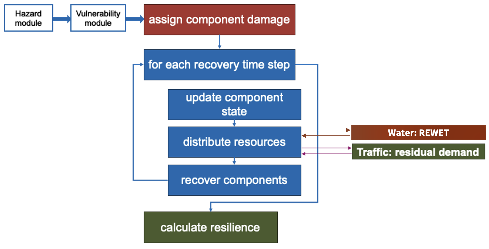
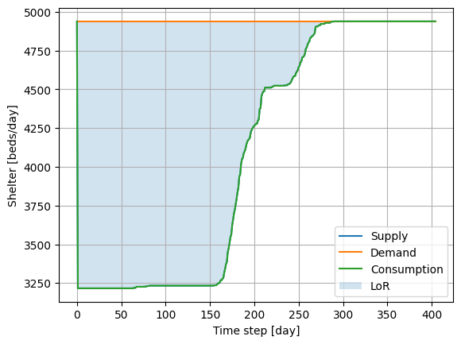
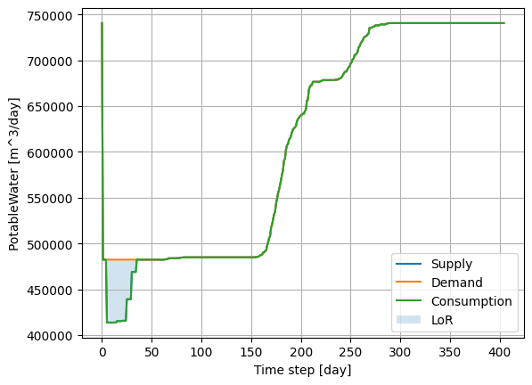
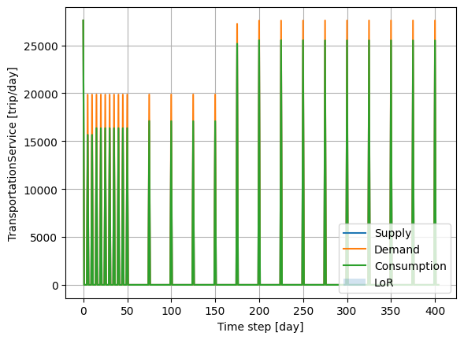

Example 5
=========

Example 5 shows how resource distribution in pyrecodes can be simulated using third-party infrastructure simulators. APIs are designed to allow for data exchange between pyrecodes and infrastructure simulators during recovery to capture system interdependencies. Case study is Alameda Island, California, where the post-earthquake recovery of residential buildings, water system and transportation system is simulated using pyrecodes. Damage information is obtained from the SimCenter's R2DTool.

Water distribution is simulated using `REWET <https://doi.org/10.1061/JITSE4.ISENG-2427>`_. Traffic flow is simulated using `residual demand traffic distribution model <https://github.com/cb-cities/residual_demand>`_. 

Both models account for the change in resource demand as well as supply during the recovery simulation. Water demand changes as people leave damaged buildings and return when buildings are repaired. Water supply changes depending on the functional state of water distribution system components. Traffic demand changes by modifying the OD matrix as defined in the demand ruleset file provided by the user. Traffic supply changes depending on the functional state of the road network components and can be further specified by modifying the capacity ruleset file provided by the user.

.. figure:: ../../figures/example_5_recovery_animation.gif
        :alt: Recovery animation

        Animated recovery simulation of a single locality in Alameda Island, California.
        


        Resource distribution in pyrecodes can be done using third-party software.

Running the example
-------------------

Example 5 Jupyter notebook illustrates how to run the pyrecodes simulation, plot the post-disaster supply/demand/consumption dynamics, components' recovery gantt chart, and animate the building recovery process.

.. hint::

    To reduce the computational time, one neighbourhood in Alameda is run by default in this example. The user can run the simulation for the entire Alameda Island by setting the main file to `Alameda_Main.json` instead of `SmallAlameda_Main.json`.

Run the example online using `Google Colab <https://colab.research.google.com/github/NikolaBlagojevic/pyrecodes/blob/main/Example5_Alameda_Colab.ipynb>`_.
    
Alternatively, the example can be run locally by downloading the `Example 5 Jupyter notebook <https://github.com/NikolaBlagojevic/pyrecodes/blob/main/Example5_Alameda.ipynb>`_ and the required files from the `Example 5 folder <https://github.com/NikolaBlagojevic/pyrecodes/tree/main/Example%205>`_. 

Component library
-----------------

Example 5 considers the following components:
    - Recovery resource supplier: EmergencyResponseCenter
    - Buildings
    - Water distribution system components: pipes
    - Transportation system components: roads, bridges and tunnels

EmergencyResponseCenter
```````````````````````

.. toggle::

    .. code-block:: json

        "EmergencyResponseCenter": {
            "ComponentClass": {"FileName": "standard_irecodes_component", "ClassName": "StandardiReCoDeSComponent"},
            "RecoveryModel": {
                "FileName": "no_recovery_activity_model",
                "ClassName": "NoRecoveryActivityModel",
                "Parameters": {},
                "DamageFunctionalityRelation": {
                    "Type": "Constant"
                }
            },
            "Supply": {
                "FirstResponderEngineer": {
                    "Amount": 1000,
                    "FunctionalityToAmountRelation": "Linear"
                },
                "SeniorEngineer": {
                    "Amount": 5000,
                    "FunctionalityToAmountRelation": "Linear"
                },
                "Contractor": {
                    "Amount": 5000,
                    "FunctionalityToAmountRelation": "Linear"
                },
                "Money": {
                    "Amount": 150000000,
                    "FunctionalityToAmountRelation": "Linear"
                },
                "PlanCheckEngineeringTeam": {
                    "Amount": 1000,
                    "FunctionalityToAmountRelation": "Linear"
                },
                "SitePreparationCrew": {
                    "Amount": 5000,
                    "FunctionalityToAmountRelation": "Linear"
                },
                "CleanUpCrew": {
                    "Amount": 2000,
                    "FunctionalityToAmountRelation": "Linear"
                },
                "EngineeringDesignTeam": {
                    "Amount": 5000,
                    "FunctionalityToAmountRelation": "Linear"
                },
                "DemolitionCrew": {
                    "Amount": 1000,
                    "FunctionalityToAmountRelation": "Linear"
                },
                "RepairCrew_Buildings": {
                    "Amount": 4000,
                    "FunctionalityToAmountRelation": "Linear"
                },
                "RepairCrew_Transportation": {
                    "Amount": 1500,
                    "FunctionalityToAmountRelation": "Linear"
                },
                "RepairCrew_Water": {
                    "Amount": 1500,
                    "FunctionalityToAmountRelation": "Linear"
                }
            }
        },

Buildings
``````````

.. toggle::

    Building in Damage State 0

    .. toggle::

        .. code-block:: json

            "DS0_Building": {
                "ComponentClass": {"FileName": "r2d_component", "ClassName": "R2DBuilding"},
                "RecoveryModel": {
                    "FileName": "no_recovery_activity_model",
                    "ClassName": "NoRecoveryActivityModel",
                    "Parameters": {},
                    "DamageFunctionalityRelation": {
                        "Type": "Constant"
                    }
                },
                "Supply": {
                    "Shelter": {
                        "Amount": 0,
                        "FunctionalityToAmountRelation": "Linear",
                        "UnmetDemandToAmountRelation": "Constant"
                    },
                    "FunctionalHousing": {
                        "Amount": 0,
                        "FunctionalityToAmountRelation": "Linear",
                        "UnmetDemandToAmountRelation": "Linear"
                    }
                },
                "OperationDemand": {
                    "Shelter": {
                        "Amount": 0,
                        "FunctionalityToAmountRelation": "Constant"
                    },
                    "FunctionalHousing": {
                        "Amount": 0,
                        "FunctionalityToAmountRelation": "Constant"
                    },
                    "ElectricPower": {
                        "Amount": 0,
                        "FunctionalityToAmountRelation": "Linear"
                    },
                    "PotableWater": {
                        "Amount": 0,
                        "FunctionalityToAmountRelation": "Linear"
                    },
                    "CellularCommunication": {
                        "Amount": 0,
                        "FunctionalityToAmountRelation": "Linear"
                    }
                }
            },

    Building in Damage State 1

    .. toggle::

        .. code-block:: json

            "DS1_Building": {
                "ComponentClass": {"FileName": "r2d_component", "ClassName": "R2DBuilding"},
                "RecoveryModel": {
                    "FileName": "component_level_recovery_activities_model",
                    "ClassName": "ComponentLevelRecoveryActivitiesModel",
                    "Parameters": {
                        "RapidInspection": {
                            "Duration": {
                                "Lognormal": {
                                    "Median": 1,
                                    "Dispersion": 0.0
                                }
                            },
                            "Demand": [
                                {
                                    "Resource": "FirstResponderEngineer",
                                    "Amount": 0.1
                                }
                            ],
                            "PrecedingActivities": []
                        },
                        "ContractorMobilization": {
                            "Duration": {
                                "Lognormal": {
                                    "Median": 7,
                                    "Dispersion": 0.2
                                }
                            },
                            "Demand": [
                                {
                                    "Resource": "Contractor",
                                    "Amount": 1
                                }
                            ],
                            "PrecedingActivities": [
                                "RapidInspection"
                            ]
                        },
                        "Repair": {
                            "Duration": {
                                "Lognormal": {
                                    "Median": 5,
                                    "Dispersion": 0.2
                                }
                            },
                            "Demand": [
                                {
                                    "Resource": "RepairCrew_Buildings",
                                    "Amount": 0
                                }
                            ],
                            "PrecedingActivities": [
                                "RapidInspection",
                                "ContractorMobilization"
                            ]
                        }
                    },
                    "DamageFunctionalityRelation": {
                        "Type": "Constant"
                    }
                },
                "Supply": {
                    "Shelter": {
                        "Amount": 0,
                        "FunctionalityToAmountRelation": "Linear",
                        "UnmetDemandToAmountRelation": "Constant"
                    },
                    "FunctionalHousing": {
                        "Amount": 0,
                        "FunctionalityToAmountRelation": "Linear",
                        "UnmetDemandToAmountRelation": "Linear"
                    }
                },
                "OperationDemand": {
                    "Shelter": {
                        "Amount": 0,
                        "FunctionalityToAmountRelation": "Constant"
                    },
                    "FunctionalHousing": {
                        "Amount": 0,
                        "FunctionalityToAmountRelation": "Constant"
                    },
                    "ElectricPower": {
                        "Amount": 0,
                        "FunctionalityToAmountRelation": "Linear"
                    },
                    "PotableWater": {
                        "Amount": 0,
                        "FunctionalityToAmountRelation": "Linear"
                    },
                    "CellularCommunication": {
                        "Amount": 0,
                        "PostDisasterIncreaseDueToEmergencyCalls": "True",
                        "FunctionalityToAmountRelation": "Linear"
                    }
                }
            },

    Building in Damage State 2

    .. toggle::

        .. code-block:: json

            "DS2_Building": {
                "ComponentClass": {"FileName": "r2d_component", "ClassName": "R2DBuilding"},
                "RecoveryModel": {
                    "FileName": "component_level_recovery_activities_model",
                    "ClassName": "ComponentLevelRecoveryActivitiesModel",
                    "Parameters": {
                        "RapidInspection": {
                            "Duration": {
                                "Lognormal": {
                                    "Median": 1,
                                    "Dispersion": 0.0
                                }
                            },
                            "Demand": [
                                {
                                    "Resource": "FirstResponderEngineer",
                                    "Amount": 0.1
                                }
                            ],
                            "PrecedingActivities": []
                        },
                        "DetailedInspection": {
                            "Duration": {
                                "Lognormal": {
                                    "Median": 7,
                                    "Dispersion": 0.2
                                }
                            },
                            "Demand": [
                                {
                                    "Resource": "SeniorEngineer",
                                    "Amount": 2
                                }
                            ],
                            "PrecedingActivities": [
                                "RapidInspection"
                            ]
                        },
                        "CleanUp": {
                            "Duration": {
                                "Lognormal": {
                                    "Median": 3,
                                    "Dispersion": 0.2
                                }
                            },
                            "Demand": [
                                {
                                    "Resource": "CleanUpCrew",
                                    "Amount": 1
                                }
                            ],
                            "PrecedingActivities": [
                                "RapidInspection"
                            ]
                        },
                        "Financing": {
                            "Duration": {
                                "Lognormal": {
                                    "Median": 7,
                                    "Dispersion": 0.2
                                }
                            },
                            "Demand": [
                                {
                                    "Resource": "Money",
                                    "Amount": 0.1
                                }
                            ],
                            "PrecedingActivities": [
                                "RapidInspection",
                                "DetailedInspection"
                            ]
                        },
                        "ArchAndEngDesign": {
                            "Duration": {
                                "Lognormal": {
                                    "Median": 21,
                                    "Dispersion": 0.2
                                }
                            },
                            "Demand": [
                                {
                                    "Resource": "EngineeringDesignTeam",
                                    "Amount": 1
                                }
                            ],
                            "PrecedingActivities": [
                                "RapidInspection",
                                "DetailedInspection"
                            ]
                        },
                        "ContractorMobilization": {
                            "Duration": {
                                "Lognormal": {
                                    "Median": 7,
                                    "Dispersion": 0.2
                                }
                            },
                            "Demand": [
                                {
                                    "Resource": "Contractor",
                                    "Amount": 1
                                }
                            ],
                            "PrecedingActivities": [
                                "RapidInspection",
                                "DetailedInspection",
                                "ArchAndEngDesign"
                            ]
                        },
                        "Permitting": {
                            "Duration": {
                                "Lognormal": {
                                    "Median": 14,
                                    "Dispersion": 0.2
                                }
                            },
                            "Demand": [
                                {
                                    "Resource": "PlanCheckEngineeringTeam",
                                    "Amount": 1
                                }
                            ],
                            "PrecedingActivities": [
                                "RapidInspection",
                                "DetailedInspection",
                                "ArchAndEngDesign"
                            ]
                        },
                        "Repair": {
                            "Duration": {
                                "Lognormal": {
                                    "Median": 30,
                                    "Dispersion": 0.2
                                }
                            },
                            "Demand": [
                                {
                                    "Resource": "RepairCrew_Buildings",
                                    "Amount": 0
                                }
                            ],
                            "PrecedingActivities": [
                                "RapidInspection",
                                "DetailedInspection",
                                "CleanUp",
                                "Financing",
                                "ArchAndEngDesign",
                                "ContractorMobilization",
                                "Permitting"
                            ]
                        }
                    },
                    "DamageFunctionalityRelation": {
                        "Type": "ReverseBinary"
                    }
                },
                "Supply": {
                    "Shelter": {
                        "Amount": 0,
                        "FunctionalityToAmountRelation": "Linear",
                        "UnmetDemandToAmountRelation": "Constant"
                    },
                    "FunctionalHousing": {
                        "Amount": 0,
                        "FunctionalityToAmountRelation": "Linear",
                        "UnmetDemandToAmountRelation": "Linear"
                    }
                },
                "OperationDemand": {
                    "Shelter": {
                        "Amount": 0,
                        "FunctionalityToAmountRelation": "Constant"
                    },
                    "FunctionalHousing": {
                        "Amount": 0,
                        "FunctionalityToAmountRelation": "Constant"
                    },
                    "ElectricPower": {
                        "Amount": 0,
                        "FunctionalityToAmountRelation": "Linear"
                    },
                    "PotableWater": {
                        "Amount": 0,
                        "FunctionalityToAmountRelation": "Linear"
                    },
                    "CellularCommunication": {
                        "Amount": 0,
                        "PostDisasterIncreaseDueToEmergencyCalls": "True",
                        "FunctionalityToAmountRelation": "Linear"
                    }
                }
            },

    Building in Damage State 3

    .. toggle::

        .. code-block:: json

            "DS3_Building": {
                "ComponentClass": {"FileName": "r2d_component", "ClassName": "R2DBuilding"},
                "RecoveryModel": {
                    "FileName": "component_level_recovery_activities_model",
                    "ClassName": "ComponentLevelRecoveryActivitiesModel",
                    "Parameters": {
                        "RapidInspection": {
                            "Duration": {
                                "Lognormal": {
                                    "Median": 1,
                                    "Dispersion": 0.0
                                }
                            },
                            "Demand": [
                                {
                                    "Resource": "FirstResponderEngineer",
                                    "Amount": 0.1
                                }
                            ],
                            "PrecedingActivities": []
                        },
                        "DetailedInspection": {
                            "Duration": {
                                "Lognormal": {
                                    "Median": 14,
                                    "Dispersion": 0.2
                                }
                            },
                            "Demand": [
                                {
                                    "Resource": "SeniorEngineer",
                                    "Amount": 2
                                }
                            ],
                            "PrecedingActivities": [
                                "RapidInspection"
                            ]
                        },
                        "CleanUp": {
                            "Duration": {
                                "Lognormal": {
                                    "Median": 7,
                                    "Dispersion": 0.2
                                }
                            },
                            "Demand": [
                                {
                                    "Resource": "CleanUpCrew",
                                    "Amount": 1
                                }
                            ],
                            "PrecedingActivities": [
                                "RapidInspection"
                            ]
                        },
                        "SitePreparation": {
                            "Duration": {
                                "Lognormal": {
                                    "Median": 7,
                                    "Dispersion": 0.2
                                }
                            },
                            "Demand": [
                                {
                                    "Resource": "SitePreparationCrew",
                                    "Amount": 1
                                }
                            ],
                            "PrecedingActivities": [
                                "RapidInspection"
                            ]
                        },
                        "Financing": {
                            "Duration": {
                                "Lognormal": {
                                    "Median": 42,
                                    "Dispersion": 0.2
                                }
                            },
                            "Demand": [
                                {
                                    "Resource": "Money",
                                    "Amount": 0.4
                                }
                            ],
                            "PrecedingActivities": [
                                "RapidInspection",
                                "DetailedInspection"
                            ]
                        },
                        "ArchAndEngDesign": {
                            "Duration": {
                                "Lognormal": {
                                    "Median": 42,
                                    "Dispersion": 0.2
                                }
                            },
                            "Demand": [
                                {
                                    "Resource": "EngineeringDesignTeam",
                                    "Amount": 1
                                }
                            ],
                            "PrecedingActivities": [
                                "RapidInspection",
                                "DetailedInspection"
                            ]
                        },
                        "ContractorMobilization": {
                            "Duration": {
                                "Lognormal": {
                                    "Median": 14,
                                    "Dispersion": 0.2
                                }
                            },
                            "Demand": [
                                {
                                    "Resource": "Contractor",
                                    "Amount": 1
                                }
                            ],
                            "PrecedingActivities": [
                                "RapidInspection",
                                "DetailedInspection",
                                "ArchAndEngDesign"
                            ]
                        },
                        "Permitting": {
                            "Duration": {
                                "Lognormal": {
                                    "Median": 28,
                                    "Dispersion": 0.2
                                }
                            },
                            "Demand": [
                                {
                                    "Resource": "PlanCheckEngineeringTeam",
                                    "Amount": 1
                                }
                            ],
                            "PrecedingActivities": [
                                "RapidInspection",
                                "DetailedInspection",
                                "ArchAndEngDesign"
                            ]
                        },
                        "Repair": {
                            "Duration": {
                                "Lognormal": {
                                    "Median": 120,
                                    "Dispersion": 0.2
                                }
                            },
                            "Demand": [
                                {
                                    "Resource": "RepairCrew_Buildings",
                                    "Amount": 0
                                }
                            ],
                            "PrecedingActivities": [
                                "RapidInspection",
                                "DetailedInspection",
                                "CleanUp",
                                "SitePreparation",
                                "Financing",
                                "ArchAndEngDesign",
                                "ContractorMobilization",
                                "Permitting"
                            ]
                        }
                    },
                    "DamageFunctionalityRelation": {
                        "Type": "ReverseBinary"
                    }
                },
                "Supply": {
                    "Shelter": {
                        "Amount": 0,
                        "FunctionalityToAmountRelation": "Linear",
                        "UnmetDemandToAmountRelation": "Constant"
                    },
                    "FunctionalHousing": {
                        "Amount": 0,
                        "FunctionalityToAmountRelation": "Linear",
                        "UnmetDemandToAmountRelation": "Linear"
                    }
                },
                "OperationDemand": {
                    "Shelter": {
                        "Amount": 0,
                        "FunctionalityToAmountRelation": "Constant"
                    },
                    "FunctionalHousing": {
                        "Amount": 0,
                        "FunctionalityToAmountRelation": "Constant"
                    },
                    "ElectricPower": {
                        "Amount": 0,
                        "FunctionalityToAmountRelation": "Linear"
                    },
                    "PotableWater": {
                        "Amount": 0,
                        "FunctionalityToAmountRelation": "Linear"
                    },
                    "CellularCommunication": {
                        "Amount": 0,
                        "PostDisasterIncreaseDueToEmergencyCalls": "True",
                        "FunctionalityToAmountRelation": "Linear"
                    }
                }
            },

    Building in Damage State 4

    .. toggle::

        .. code-block:: json

            "DS4_Building": {
                "ComponentClass": {"FileName": "r2d_component", "ClassName": "R2DBuilding"},
                "RecoveryModel": {
                    "FileName": "component_level_recovery_activities_model",
                    "ClassName": "ComponentLevelRecoveryActivitiesModel",
                    "Parameters": {
                        "RapidInspection": {
                            "Duration": {
                                "Lognormal": {
                                    "Median": 1,
                                    "Dispersion": 0.0
                                }
                            },
                            "Demand": [
                                {
                                    "Resource": "FirstResponderEngineer",
                                    "Amount": 0.1
                                }
                            ],
                            "PrecedingActivities": []
                        },
                        "CleanUp": {
                            "Duration": {
                                "Lognormal": {
                                    "Median": 7,
                                    "Dispersion": 0.2
                                }
                            },
                            "Demand": [
                                {
                                    "Resource": "CleanUpCrew",
                                    "Amount": 1
                                }
                            ],
                            "PrecedingActivities": [
                                "RapidInspection"
                            ]
                        },
                        "SitePreparation": {
                            "Duration": {
                                "Lognormal": {
                                    "Median": 7,
                                    "Dispersion": 0.2
                                }
                            },
                            "Demand": [
                                {
                                    "Resource": "SitePreparationCrew",
                                    "Amount": 1
                                }
                            ],
                            "PrecedingActivities": [
                                "RapidInspection"
                            ]
                        },
                        "Demolition": {
                            "Duration": {
                                "Lognormal": {
                                    "Median": 10,
                                    "Dispersion": 0.2
                                }
                            },
                            "Demand": [
                                {
                                    "Resource": "DemolitionCrew",
                                    "Amount": 1
                                }
                            ],
                            "PrecedingActivities": [
                                "RapidInspection",
                                "SitePreparation",
                                "CleanUp"
                            ]
                        },
                        "Financing": {
                            "Duration": {
                                "Lognormal": {
                                    "Median": 42,
                                    "Dispersion": 0.2
                                }
                            },
                            "Demand": [
                                {
                                    "Resource": "Money",
                                    "Amount": 1.0
                                }
                            ],
                            "PrecedingActivities": [
                                "RapidInspection"
                            ]
                        },
                        "ArchAndEngDesign": {
                            "Duration": {
                                "Lognormal": {
                                    "Median": 42,
                                    "Dispersion": 0.2
                                }
                            },
                            "Demand": [
                                {
                                    "Resource": "EngineeringDesignTeam",
                                    "Amount": 1
                                }
                            ],
                            "PrecedingActivities": [
                                "RapidInspection"
                            ]
                        },
                        "ContractorMobilization": {
                            "Duration": {
                                "Lognormal": {
                                    "Median": 14,
                                    "Dispersion": 0.2
                                }
                            },
                            "Demand": [
                                {
                                    "Resource": "Contractor",
                                    "Amount": 1
                                }
                            ],
                            "PrecedingActivities": [
                                "RapidInspection",
                                "ArchAndEngDesign"
                            ]
                        },
                        "Permitting": {
                            "Duration": {
                                "Lognormal": {
                                    "Median": 28,
                                    "Dispersion": 0.2
                                }
                            },
                            "Demand": [
                                {
                                    "Resource": "PlanCheckEngineeringTeam",
                                    "Amount": 1
                                }
                            ],
                            "PrecedingActivities": [
                                "RapidInspection",
                                "ArchAndEngDesign"
                            ]
                        },
                        "Repair": {
                            "Duration": {
                                "Lognormal": {
                                    "Median": 240,
                                    "Dispersion": 0.2
                                }
                            },
                            "Demand": [
                                {
                                    "Resource": "RepairCrew_Buildings",
                                    "Amount": 0
                                }
                            ],
                            "PrecedingActivities": [
                                "RapidInspection",
                                "CleanUp",
                                "SitePreparation",
                                "Financing",
                                "ArchAndEngDesign",
                                "ContractorMobilization",
                                "Permitting",
                                "Demolition"
                            ]
                        }
                    },
                    "DamageFunctionalityRelation": {
                        "Type": "ReverseBinary"
                    }
                },
                "Supply": {
                    "Shelter": {
                        "Amount": 0,
                        "FunctionalityToAmountRelation": "Linear",
                        "UnmetDemandToAmountRelation": "Constant"
                    },
                    "FunctionalHousing": {
                        "Amount": 0,
                        "FunctionalityToAmountRelation": "Linear",
                        "UnmetDemandToAmountRelation": "Linear"
                    }
                },
                "OperationDemand": {
                    "Shelter": {
                        "Amount": 0,
                        "FunctionalityToAmountRelation": "Constant"
                    },
                    "FunctionalHousing": {
                        "Amount": 0,
                        "FunctionalityToAmountRelation": "Constant"
                    },
                    "ElectricPower": {
                        "Amount": 0,
                        "FunctionalityToAmountRelation": "Linear"
                    },
                    "PotableWater": {
                        "Amount": 0,
                        "FunctionalityToAmountRelation": "Linear"
                    },
                    "CellularCommunication": {
                        "Amount": 0,
                        "PostDisasterIncreaseDueToEmergencyCalls": "True",
                        "FunctionalityToAmountRelation": "Linear"
                    }
                }
            },

Transportation System
````````````````````````````

.. toggle::

    Bridge in Damage State 0

    .. toggle::

        .. code-block:: json

            "DS0_Bridge": {
                "ComponentClass": {"FileName": "r2d_component", "ClassName": "R2DBridge"},
                "RecoveryModel": {
                    "FileName": "no_recovery_activity_model",
                    "ClassName": "NoRecoveryActivityModel",
                    "Parameters": {},
                    "DamageFunctionalityRelation": {
                        "Type": "Constant"
                    }
                },
                "Supply": {
                    "BridgeService": {
                        "Amount": 1,
                        "FunctionalityToAmountRelation": "Linear",
                        "UnmetDemandToAmountRelation": "Constant"
                    }
                }
            },

    Bridge in Damage State 1

    .. toggle::

        .. code-block:: json

            "DS1_Bridge": {
                "ComponentClass": {"FileName": "r2d_component", "ClassName": "R2DBridge"},
                "RecoveryModel": {
                    "FileName": "component_level_recovery_activities_model",
                    "ClassName": "ComponentLevelRecoveryActivitiesModel",
                    "Parameters": {
                        "DetailedInspection": {
                            "Duration": {
                                "Lognormal": {
                                    "Median": 1,
                                    "Dispersion": 0.0
                                }
                            },
                            "Demand": [
                                {
                                    "Resource": "FirstResponderEngineer",
                                    "Amount": 2
                                }
                            ],
                            "PrecedingActivities": []
                        },
                        "Financing": {
                            "Duration": {
                                "Lognormal": {
                                    "Median": 14,
                                    "Dispersion": 0.2
                                }
                            },
                            "Demand": [
                                {
                                    "Resource": "Money",
                                    "Amount": 0.0
                                }
                            ],
                            "PrecedingActivities": [
                                "DetailedInspection"
                            ]
                        },
                        "Repair": {
                            "Duration": {
                                "Lognormal": {
                                    "Median": 1,
                                    "Dispersion": 0.2
                                }
                            },
                            "Demand": [
                                {
                                    "Resource": "RepairCrew_Transportation",
                                    "Amount": 0
                                }
                            ],
                            "PrecedingActivities": ["DetailedInspection", "Financing"]
                        }
                    },
                    "DamageFunctionalityRelation": {
                        "Type": "ReverseBinary"
                    }
                },
                "Supply": {
                    "BridgeService": {
                        "Amount": 1,
                        "FunctionalityToAmountRelation": "Linear",
                        "UnmetDemandToAmountRelation": "Constant"
                    }
                }
            },

    Bridge in Damage State 2

    .. toggle::

        .. code-block:: json

            "DS2_Bridge": {
                "ComponentClass": {"FileName": "r2d_component", "ClassName": "R2DBridge"},
                "RecoveryModel": {
                    "FileName": "component_level_recovery_activities_model",
                    "ClassName": "ComponentLevelRecoveryActivitiesModel",
                    "Parameters": {
                        "DetailedInspection": {
                            "Duration": {
                                "Lognormal": {
                                    "Median": 1,
                                    "Dispersion": 0.0
                                }
                            },
                            "Demand": [
                                {
                                    "Resource": "FirstResponderEngineer",
                                    "Amount": 2
                                }
                            ],
                            "PrecedingActivities": []
                        },
                        "Financing": {
                            "Duration": {
                                "Lognormal": {
                                    "Median": 14,
                                    "Dispersion": 0.2
                                }
                            },
                            "Demand": [
                                {
                                    "Resource": "Money",
                                    "Amount": 0.0
                                }
                            ],
                            "PrecedingActivities": [
                                "DetailedInspection"
                            ]
                        },
                        "Repair": {
                            "Duration": {
                                "Lognormal": {
                                    "Median": 2,
                                    "Dispersion": 0.2
                                }
                            },
                            "Demand": [
                                {
                                    "Resource": "RepairCrew_Transportation",
                                    "Amount": 0
                                }
                            ],
                            "PrecedingActivities": ["DetailedInspection", "Financing"]
                        }
                    },
                    "DamageFunctionalityRelation": {
                        "Type": "ReverseBinary"
                    }
                },
                "Supply": {
                    "BridgeService": {
                        "Amount": 1,
                        "FunctionalityToAmountRelation": "Linear",
                        "UnmetDemandToAmountRelation": "Constant"
                    }
                }
            },

    Bridge in Damage State 3

    .. toggle::

        .. code-block:: json        

            "DS3_Bridge": {
                "ComponentClass": {"FileName": "r2d_component", "ClassName": "R2DBridge"},
                "RecoveryModel": {
                    "FileName": "component_level_recovery_activities_model",
                    "ClassName": "ComponentLevelRecoveryActivitiesModel",
                    "Parameters": {
                        "DetailedInspection": {
                            "Duration": {
                                "Lognormal": {
                                    "Median": 1,
                                    "Dispersion": 0.0
                                }
                            },
                            "Demand": [
                                {
                                    "Resource": "FirstResponderEngineer",
                                    "Amount": 2
                                }
                            ],
                            "PrecedingActivities": []
                        },
                        "Financing": {
                            "Duration": {
                                "Lognormal": {
                                    "Median": 42,
                                    "Dispersion": 0.2
                                }
                            },
                            "Demand": [
                                {
                                    "Resource": "Money",
                                    "Amount": 0.0
                                }
                            ],
                            "PrecedingActivities": [
                                "DetailedInspection"
                            ]
                        },
                        "Repair": {
                            "Duration": {
                                "Lognormal": {
                                    "Median": 75,
                                    "Dispersion": 0.2
                                }
                            },
                            "Demand": [
                                {
                                    "Resource": "RepairCrew_Transportation",
                                    "Amount": 0
                                }
                            ],
                            "PrecedingActivities": ["DetailedInspection", "Financing"]
                        }
                    },
                    "DamageFunctionalityRelation": {
                        "Type": "ReverseBinary"
                    }
                },
                "Supply": {
                    "BridgeService": {
                        "Amount": 1,
                        "FunctionalityToAmountRelation": "Linear",
                        "UnmetDemandToAmountRelation": "Constant"
                    }
                }
            },

    Bridge in Damage State 4

    .. toggle::

        .. code-block:: json

            "DS4_Bridge": {
                "ComponentClass": {"FileName": "r2d_component", "ClassName": "R2DBridge"},
                "RecoveryModel": {
                    "FileName": "component_level_recovery_activities_model",
                    "ClassName": "ComponentLevelRecoveryActivitiesModel",
                    "Parameters": {
                        "DetailedInspection": {
                            "Duration": {
                                "Lognormal": {
                                    "Median": 1,
                                    "Dispersion": 0.0
                                }
                            },
                            "Demand": [
                                {
                                    "Resource": "FirstResponderEngineer",
                                    "Amount": 2
                                }
                            ],
                            "PrecedingActivities": []
                        },
                        "Financing": {
                            "Duration": {
                                "Lognormal": {
                                    "Median": 42,
                                    "Dispersion": 0.2
                                }
                            },
                            "Demand": [
                                {
                                    "Resource": "Money",
                                    "Amount": 0.0
                                }
                            ],
                            "PrecedingActivities": [
                                "DetailedInspection"
                            ]
                        },
                        "Repair": {
                            "Duration": {
                                "Lognormal": {
                                    "Median": 230,
                                    "Dispersion": 0.2
                                }
                            },
                            "Demand": [
                                {
                                    "Resource": "RepairCrew_Transportation",
                                    "Amount": 0
                                }
                            ],
                            "PrecedingActivities": ["DetailedInspection", "Financing"]
                        }
                    },
                    "DamageFunctionalityRelation": {
                        "Type": "ReverseBinary"
                    }
                },
                "Supply": {
                    "BridgeService": {
                        "Amount": 1,
                        "FunctionalityToAmountRelation": "Linear",
                        "UnmetDemandToAmountRelation": "Constant"
                    }
                }
            },

    Tunnel in Damage State 0

    .. toggle::

        .. code-block:: json

            "DS0_Tunnel": {
                "ComponentClass": {"FileName": "r2d_component", "ClassName": "R2DTunnel"},
                "RecoveryModel": {
                    "FileName": "no_recovery_activity_model",
                    "ClassName": "NoRecoveryActivityModel",
                    "Parameters": {},
                    "DamageFunctionalityRelation": {
                        "Type": "Constant"
                    }
                },
                "Supply": {
                    "TunnelService": {
                        "Amount": 1,
                        "FunctionalityToAmountRelation": "Linear",
                        "UnmetDemandToAmountRelation": "Constant"
                    }
                }
            },

    Tunnel in Damage State 1

    .. toggle::

        .. code-block:: json

            "DS1_Tunnel": {
                "ComponentClass": {"FileName": "r2d_component", "ClassName": "R2DTunnel"},
                "RecoveryModel": {
                    "FileName": "component_level_recovery_activities_model",
                    "ClassName": "ComponentLevelRecoveryActivitiesModel",
                    "Parameters": {
                        "DetailedInspection": {
                            "Duration": {
                                "Lognormal": {
                                    "Median": 1,
                                    "Dispersion": 0.0
                                }
                            },
                            "Demand": [
                                {
                                    "Resource": "FirstResponderEngineer",
                                    "Amount": 2
                                }
                            ],
                            "PrecedingActivities": []
                        },
                        "Financing": {
                            "Duration": {
                                "Lognormal": {
                                    "Median": 14,
                                    "Dispersion": 0.2
                                }
                            },
                            "Demand": [
                                {
                                    "Resource": "Money",
                                    "Amount": 0.0
                                }
                            ],
                            "PrecedingActivities": [
                                "DetailedInspection"
                            ]
                        },
                        "Repair": {
                            "Duration": {
                                "Lognormal": {
                                    "Median": 1,
                                    "Dispersion": 0.2
                                }
                            },
                            "Demand": [
                                {
                                    "Resource": "RepairCrew_Transportation",
                                    "Amount": 0
                                }
                            ],
                            "PrecedingActivities": ["DetailedInspection", "Financing"]
                        }
                    },
                    "DamageFunctionalityRelation": {
                        "Type": "ReverseBinary"
                    }
                },
                "Supply": {
                    "TunnelService": {
                        "Amount": 1,
                        "FunctionalityToAmountRelation": "Linear",
                        "UnmetDemandToAmountRelation": "Constant"
                    }
                }
            },

    Tunnel in Damage State 2

    .. toggle::

        .. code-block:: json

            "DS2_Tunnel": {
                "ComponentClass": {"FileName": "r2d_component", "ClassName": "R2DTunnel"},
                "RecoveryModel": {
                    "FileName": "component_level_recovery_activities_model",
                    "ClassName": "ComponentLevelRecoveryActivitiesModel",
                    "Parameters": {
                        "DetailedInspection": {
                            "Duration": {
                                "Lognormal": {
                                    "Median": 1,
                                    "Dispersion": 0.0
                                }
                            },
                            "Demand": [
                                {
                                    "Resource": "FirstResponderEngineer",
                                    "Amount": 2
                                }
                            ],
                            "PrecedingActivities": []
                        },
                        "Financing": {
                            "Duration": {
                                "Lognormal": {
                                    "Median": 21,
                                    "Dispersion": 0.2
                                }
                            },
                            "Demand": [
                                {
                                    "Resource": "Money",
                                    "Amount": 0.0
                                }
                            ],
                            "PrecedingActivities": [
                                "DetailedInspection"
                            ]
                        },
                        "Repair": {
                            "Duration": {
                                "Lognormal": {
                                    "Median": 3,
                                    "Dispersion": 0.2
                                }
                            },
                            "Demand": [
                                {
                                    "Resource": "RepairCrew_Transportation",
                                    "Amount": 0
                                }
                            ],
                            "PrecedingActivities": ["DetailedInspection", "Financing"]
                        }
                    },
                    "DamageFunctionalityRelation": {
                        "Type": "ReverseBinary"
                    }
                },
                "Supply": {
                    "TunnelService": {
                        "Amount": 1,
                        "FunctionalityToAmountRelation": "Linear",
                        "UnmetDemandToAmountRelation": "Constant"
                    }
                }
            },

    Tunnel in Damage State 3

    .. toggle::

        .. code-block:: json

            "DS3_Tunnel": {
                "ComponentClass": {"FileName": "r2d_component", "ClassName": "R2DTunnel"},
                "RecoveryModel": {
                    "FileName": "component_level_recovery_activities_model",
                    "ClassName": "ComponentLevelRecoveryActivitiesModel",
                    "Parameters": {
                        "DetailedInspection": {
                            "Duration": {
                                "Lognormal": {
                                    "Median": 1,
                                    "Dispersion": 0.0
                                }
                            },
                            "Demand": [
                                {
                                    "Resource": "FirstResponderEngineer",
                                    "Amount": 2
                                }
                            ],
                            "PrecedingActivities": []
                        },
                        "Financing": {
                            "Duration": {
                                "Lognormal": {
                                    "Median": 42,
                                    "Dispersion": 0.2
                                }
                            },
                            "Demand": [
                                {
                                    "Resource": "Money",
                                    "Amount": 0.0
                                }
                            ],
                            "PrecedingActivities": [
                                "DetailedInspection"
                            ]
                        },
                        "Repair": {
                            "Duration": {
                                "Lognormal": {
                                    "Median": 45,
                                    "Dispersion": 0.2
                                }
                            },
                            "Demand": [
                                {
                                    "Resource": "RepairCrew_Transportation",
                                    "Amount": 0
                                }
                            ],
                            "PrecedingActivities": ["DetailedInspection", "Financing"]
                        }
                    },
                    "DamageFunctionalityRelation": {
                        "Type": "ReverseBinary"
                    }
                },
                "Supply": {
                    "TunnelService": {
                        "Amount": 1,
                        "FunctionalityToAmountRelation": "Linear",
                        "UnmetDemandToAmountRelation": "Constant"
                    }
                }
            },

    Tunnel in Damage State 4

    .. toggle::

        .. code-block:: json

            "DS4_Tunnel": {
                "ComponentClass": {"FileName": "r2d_component", "ClassName": "R2DTunnel"},
                "RecoveryModel": {
                    "FileName": "component_level_recovery_activities_model",
                    "ClassName": "ComponentLevelRecoveryActivitiesModel",
                    "Parameters": {
                        "DetailedInspection": {
                            "Duration": {
                                "Lognormal": {
                                    "Median": 1,
                                    "Dispersion": 0.0
                                }
                            },
                            "Demand": [
                                {
                                    "Resource": "FirstResponderEngineer",
                                    "Amount": 2
                                }
                            ],
                            "PrecedingActivities": []
                        },
                        "Financing": {
                            "Duration": {
                                "Lognormal": {
                                    "Median": 42,
                                    "Dispersion": 0.2
                                }
                            },
                            "Demand": [
                                {
                                    "Resource": "Money",
                                    "Amount": 0.0
                                }
                            ],
                            "PrecedingActivities": [
                                "DetailedInspection"
                            ]
                        },
                        "Repair": {
                            "Duration": {
                                "Lognormal": {
                                    "Median": 210,
                                    "Dispersion": 0.2
                                }
                            },
                            "Demand": [
                                {
                                    "Resource": "RepairCrew_Transportation",
                                    "Amount": 0
                                }
                            ],
                            "PrecedingActivities": ["DetailedInspection", "Financing"]
                        }
                    },
                    "DamageFunctionalityRelation": {
                        "Type": "ReverseBinary"
                    }
                },
                "Supply": {
                    "TunnelService": {
                        "Amount": 1,
                        "FunctionalityToAmountRelation": "Linear",
                        "UnmetDemandToAmountRelation": "Constant"
                    }
                }
            },

    Roadway in Damage State 0

    .. toggle::

        .. code-block:: json

            "DS0_Roadway": {
                "ComponentClass": {"FileName": "r2d_component", "ClassName": "R2DRoadway"},
                "RecoveryModel": {
                    "FileName": "no_recovery_activity_model",
                    "ClassName": "NoRecoveryActivityModel",
                    "Parameters": {},
                    "DamageFunctionalityRelation": {
                        "Type": "Constant"
                    }
                },
                "Supply": {
                    "TransportationService": {
                        "Amount": 1,
                        "FunctionalityToAmountRelation": "Linear",
                        "UnmetDemandToAmountRelation": "Constant"
                    }
                }
            },

    Roadway in Damage State 1

    .. toggle::

        .. code-block:: json

            "DS1_Roadway": {
                "ComponentClass": {"FileName": "r2d_component", "ClassName": "R2DRoadway"},
                "RecoveryModel": {
                    "FileName": "component_level_recovery_activities_model",
                    "ClassName": "ComponentLevelRecoveryActivitiesModel",
                    "Parameters": {
                        "DetailedInspection": {
                            "Duration": {
                                "Lognormal": {
                                    "Median": 1,
                                    "Dispersion": 0.0
                                }
                            },
                            "Demand": [
                                {
                                    "Resource": "FirstResponderEngineer",
                                    "Amount": 0.5
                                }
                            ],
                            "PrecedingActivities": []
                        },
                        "Repair": {
                            "Duration": {
                                "Lognormal": {
                                    "Median": 1,
                                    "Dispersion": 0.0
                                }
                            },
                            "Demand": [
                                {
                                    "Resource": "RepairCrew_Transportation",
                                    "Amount": 0
                                }
                            ],
                            "PrecedingActivities": ["DetailedInspection"]
                        }
                    },
                    "DamageFunctionalityRelation": {
                        "Type": "ReverseBinary"
                    }
                },
                "Supply": {
                    "TransportationService": {
                        "Amount": 1,
                        "FunctionalityToAmountRelation": "Linear",
                        "UnmetDemandToAmountRelation": "Constant"
                    }
                }
            },

    Roadway in Damage State 2

    .. toggle::

        .. code-block:: json

            "DS2_Roadway": {
                "ComponentClass": {"FileName": "r2d_component", "ClassName": "R2DRoadway"},
                "RecoveryModel": {
                    "FileName": "component_level_recovery_activities_model",
                    "ClassName": "ComponentLevelRecoveryActivitiesModel",
                    "Parameters": {
                        "DetailedInspection": {
                            "Duration": {
                                "Lognormal": {
                                    "Median": 1,
                                    "Dispersion": 0.0
                                }
                            },
                            "Demand": [
                                {
                                    "Resource": "FirstResponderEngineer",
                                    "Amount": 0.5
                                }
                            ],
                            "PrecedingActivities": []
                        },
                        "Repair": {
                            "Duration": {
                                "Lognormal": {
                                    "Median": 2.0,
                                    "Dispersion": 0.2
                                }
                            },
                            "Demand": [
                                {
                                    "Resource": "RepairCrew_Transportation",
                                    "Amount": 0
                                }
                            ],
                            "PrecedingActivities": ["DetailedInspection"]
                        }
                    },
                    "DamageFunctionalityRelation": {
                        "Type": "ReverseBinary"
                    }
                },
                "Supply": {
                    "TransportationService": {
                        "Amount": 1,
                        "FunctionalityToAmountRelation": "Linear",
                        "UnmetDemandToAmountRelation": "Constant"
                    }
                }
            },

    Roadway in Damage State 3

    .. toggle::

        .. code-block:: json

            "DS3_Roadway": {
                "ComponentClass": {"FileName": "r2d_component", "ClassName": "R2DRoadway"},
                "RecoveryModel": {
                    "FileName": "component_level_recovery_activities_model",
                    "ClassName": "ComponentLevelRecoveryActivitiesModel",
                    "Parameters": {
                        "DetailedInspection": {
                            "Duration": {
                                "Lognormal": {
                                    "Median": 1,
                                    "Dispersion": 0.0
                                }
                            },
                            "Demand": [
                                {
                                    "Resource": "FirstResponderEngineer",
                                    "Amount": 0.5
                                }
                            ],
                            "PrecedingActivities": []
                        },
                        "Repair": {
                            "Duration": {
                                "Lognormal": {
                                    "Median": 21.0,
                                    "Dispersion": 0.2
                                }
                            },
                            "Demand": [
                                {
                                    "Resource": "RepairCrew_Transportation",
                                    "Amount": 0
                                }
                            ],
                            "PrecedingActivities": ["DetailedInspection"]
                        }
                    },
                    "DamageFunctionalityRelation": {
                        "Type": "ReverseBinary"
                    }
                },
                "Supply": {
                    "TransportationService": {
                        "Amount": 1,
                        "FunctionalityToAmountRelation": "Linear",
                        "UnmetDemandToAmountRelation": "Constant"
                    }
                }
            },

    Roadway in Damage State 4

    .. toggle::

        .. code-block:: json

            "DS4_Roadway": {
                "ComponentClass": {"FileName": "r2d_component", "ClassName": "R2DRoadway"},
                "RecoveryModel": {
                    "FileName": "component_level_recovery_activities_model",
                    "ClassName": "ComponentLevelRecoveryActivitiesModel",
                    "Parameters": {
                        "DetailedInspection": {
                            "Duration": {
                                "Lognormal": {
                                    "Median": 1,
                                    "Dispersion": 0.0
                                }
                            },
                            "Demand": [
                                {
                                    "Resource": "FirstResponderEngineer",
                                    "Amount": 0.5
                                }
                            ],
                            "PrecedingActivities": []
                        },
                        "Repair": {
                            "Duration": {
                                "Lognormal": {
                                    "Median": 21,
                                    "Dispersion": 0.2
                                }
                            },
                            "Demand": [
                                {
                                    "Resource": "RepairCrew_Transportation",
                                    "Amount": 0.0
                                }
                            ],
                            "PrecedingActivities": ["DetailedInspection"]
                        }
                    },
                    "DamageFunctionalityRelation": {
                        "Type": "ReverseBinary"
                    }
                },
                "Supply": {
                    "TransportationService": {
                        "Amount": 1,
                        "FunctionalityToAmountRelation": "Linear",
                        "UnmetDemandToAmountRelation": "Constant"
                    }
                }
            },

Water Distribution System
````````````````````````````

.. toggle::
    
    Pipe in Damage State 0

    .. toggle::

        .. code-block:: json

            "DS0_Pipe": {
                "ComponentClass": {"FileName": "r2d_component", "ClassName": "R2DPipe"},
                "RecoveryModel": {
                    "FileName": "no_recovery_activity_model",
                    "ClassName": "NoRecoveryActivityModel",
                    "Parameters": {
                    },
                    "DamageFunctionalityRelation": {
                        "Type": "Constant"
                    }
                },
                "Supply": {
                    "WaterTransferService": {
                        "Amount": 1,
                        "FunctionalityToAmountRelation": "Linear",
                        "UnmetDemandToAmountRelation": "Constant"
                    }
                }
            },

    Pipe in Damage State 1

    .. toggle::

        .. code-block:: json   

            "DS1_Pipe": {
                "ComponentClass": {"FileName": "r2d_component", "ClassName": "R2DPipe"},
                "RecoveryModel": {
                    "FileName": "component_level_recovery_activities_model",
                    "ClassName": "ComponentLevelRecoveryActivitiesModel",
                    "Parameters": {
                        "Inspection": {
                            "Duration": {
                                "Lognormal": {
                                    "Median": 1,
                                    "Dispersion": 0.0
                                }
                            },
                            "Demand": [
                                {
                                    "Resource": "FirstResponderEngineer",
                                    "Amount": 0.0
                                }
                            ],
                            "PrecedingActivities": []
                        },
                        "Repair": {
                            "Duration": {
                                "Lognormal": {
                                    "Median": 10,
                                    "Dispersion": 0.2
                                }
                            },
                            "Demand": [
                                {
                                    "Resource": "RepairCrew_Water",
                                    "Amount": 1.0
                                }
                            ],
                            "PrecedingActivities": [
                                "Inspection"
                            ]
                        }
                    },
                    "DamageFunctionalityRelation": {
                        "Type": "ReverseBinary"
                    }
                },
                "Supply": {
                    "WaterTransferService": {
                        "Amount": 1,
                        "FunctionalityToAmountRelation": "Linear",
                        "UnmetDemandToAmountRelation": "Constant"
                    }
                }
            },

    Pipe in Damage State 2

    .. toggle::

        .. code-block:: json

        "DS2_Pipe": {
            "ComponentClass": {"FileName": "r2d_component", "ClassName": "R2DPipe"},
            "RecoveryModel": {
                "FileName": "component_level_recovery_activities_model",
                "ClassName": "ComponentLevelRecoveryActivitiesModel",
                "Parameters": {
                    "Inspection": {
                        "Duration": {
                            "Lognormal": {
                                "Median": 1,
                                "Dispersion": 0.0
                            }
                        },
                        "Demand": [
                            {
                                "Resource": "FirstResponderEngineer",
                                "Amount": 0.0
                            }
                        ],
                        "PrecedingActivities": []
                    },
                    "Repair": {
                        "Duration": {
                            "Lognormal": {
                                "Median": 20,
                                "Dispersion": 0.2
                            }
                        },
                        "Demand": [
                            {
                                "Resource": "RepairCrew_Water",
                                "Amount": 1.0
                            }
                        ],
                        "PrecedingActivities": [
                            "Inspection"
                        ]
                    }
                },
                "DamageFunctionalityRelation": {
                    "Type": "ReverseBinary"
                }
            },
            "Supply": {
                "WaterTransferService": {
                    "Amount": 1,
                    "FunctionalityToAmountRelation": "Linear",
                    "UnmetDemandToAmountRelation": "Constant"
                }
            }
        }

System configuration
--------------------

System configuration file for Example 5 illustrates how to define inputs for the infrastructure model APIs and define sparse distribution time stepping. Otherwise, definition of the system configuration is similar to the previous examples. System configuration file for the small Alameda case study is presented here for brevity. 


Constants
`````````

Novel constants introduced in Example 5 represent the repair crew demand of damaged infrastructure components. They include the values used to estimate operational demand of residential buildings for infrastructure services. Such values are obtained by multiplying the number of residents in a building at a time step of the resilience assessment interval and the resource demand per person. Remaining constants are explained in Example 3.

.. toggle::

    .. code-block:: json

        "Constants": {
            "START_TIME_STEP": 0,
            "MAX_TIME_STEP": 500,
            "DISASTER_TIME_STEP": 1,
            "MAX_REPAIR_CREW_DEMAND_PER_BUILDING": 50,
            "HOUSING_RESOURCES": [
                "Shelter",
                "FunctionalHousing"
            ],
            "REPAIR_CREW_DEMAND_PER_SQFT": {
                "DS1": 5400,
                "DS2": 5400,
                "DS3": 2700,
                "DS4": 2700
            },
            "REPAIR_CREW_DEMAND_PER_MILE_ROADWAY": 5,
            "REPAIR_CREW_DEMAND_PER_MILE_TUNNEL": 5,
            "REPAIR_CREW_DEMAND_PER_MILE_BRIDGE": 5,
            "REPAIR_CREW_DEMAND_PER_MILE_PIPE": 5,
            "DEFAULT_REPAIR_DURATION_DICT": {
                "Lognormal": {
                    "Median": 0,
                    "Dispersion": 0.3
                }
            },
            "DEMAND_PER_PERSON": {
                "ElectricPower": 0.02,
                "PotableWater": 150,
                "CellularCommunication": 0.033
            }
        },

Content
```````

Localities are based on Travel Analysis Zones in Alameda. The small Alameda case study considers only a single locality, while the complete case study has 15 localities.

.. toggle::

    .. code-block:: json

        "Content": {
             "Locality 2": {
                "Coordinates": {
                    "GeoJSON": {
                        "Filename": "./Example 5/Alameda TAZ/Alameda_TravelAnalysisZone_963.geojson"
                    }
                },
                "Components": {
                    "RecoveryResourceSuppliers": [
                        {
                            "EmergencyResponseCenter": {
                                "CreatorClassName": "RecoveryResourceSuppliersCreator",
                                "CreatorFileName": "recovery_resource_suppliers_creator",
                                "Parameters": {
                                    "ComponentName": [
                                        "EmergencyResponseCenter"
                                    ]
                                }
                            }
                        }
                    ],
                    "Infrastructure": [
                        {
                            "TransportationSystem": {
                                "CreatorClassName": "R2DSubsystemCreator",
                                "CreatorFileName": "r2d_subsystem_creator",
                                "Parameters": {
                                    "Resource": [
                                        "TransportationService"
                                    ],
                                    "R2DJSONFile_Info": "./Example 5/Alameda_Exposure.json",
                                    "SubsystemNameInR2DJSON": "TransportationNetwork",
                                    "AssetTypes": [
                                        "Bridge",
                                        "Roadway",
                                        "Tunnel"
                                    ]
                                }
                            }
                        },
                        {
                            "WaterSupplySystem": {
                                "CreatorClassName": "R2DSubsystemCreator",
                                "CreatorFileName": "r2d_subsystem_creator",
                                "Parameters": {
                                    "Resource": [
                                        "Water"
                                    ],
                                    "R2DJSONFile_Info": "./Example 5/Alameda_Exposure.json",
                                    "SubsystemNameInR2DJSON": "WaterDistributionNetwork",
                                    "AssetTypes": [
                                        "Pipe"
                                    ],
                                    "MaxNumComponents": 10000
                                }
                            }
                        }
                    ],
                    "BuildingStock": [
                        {
                            "Buildings": {
                                "CreatorClassName": "R2DSubsystemCreator",
                                "CreatorFileName": "r2d_subsystem_creator",
                                "Parameters": {
                                    "Resource": [
                                        "Shelter",
                                        "FunctionalHousing"
                                    ],
                                    "R2DJSONFile_Info": "./Example 5/Alameda_Exposure.json",
                                    "SubsystemNameInR2DJSON": "Buildings",
                                    "AssetTypes": [
                                        "Building"
                                    ],
                                    "MaxNumComponents": 10000
                                }
                            }
                        }
                    ]
                }
            }
        },


Damage Input
````````````

Damage input is read from the R2DTool's output for both buildings and infrastructure components. The API for the REWET model requires the damage data to be set up at the start of the simulation. This is done by providing the name of the resource which is distributed using REWET in the "DistributionModelDamage" parameter.

.. toggle::

    .. code-block:: json

        "DamageInput": {
            "FileName": "r2d_damage_input",
            "ClassName": "R2DDamageInput",
            "Parameters": {
                "DamageFile": "./Example 5/Alameda_Damage.json",
                "DistributionModelDamage": [
                    "PotableWater"
                ]
            }
        },

Resources
``````````

Example 5 considers shelter, transportation service, potable water and all recovery resources defined in Example 3 refined to distinguish repair crews for buildings, water and transportation infrastructure. 

.. hint::

    Note how the parameters of the transportation service and potable water are defined to connect the pyrecodes simulation with the infrastructure model APIs.

.. toggle::

    .. code-block:: json

        "Resources": {
            "Shelter": {
                "Group": "Utilities",
                "DistributionModel": {
                    "ClassName": "HousingDistributionModel",
                    "FileName": "housing_distribution_model",
                    "Parameters": {
                        "DistributionTimeStepping": [
                            {
                                "start": 0,
                                "end": 50,
                                "step": 5
                            },
                            {
                                "start": 50,
                                "end": 1000,
                                "step": 50
                            }
                        ]
                    }
                }
            },
            "FirstResponderEngineer": {
                "Group": "RecoveryResources",
                "DistributionModel": {
                    "ClassName": "UtilityDistributionModel",
                    "FileName": "utility_distribution_model",
                    "Parameters": {
                        "DistributionPriority": {
                            "FileName": "random_priority",
                            "ClassName": "RandomPriority",
                            "Parameters": {
                                "Seed": 42.0,
                                "DemandType": [
                                    "RecoveryDemand"
                                ]
                            }
                        }
                    }
                }
            },
            "SeniorEngineer": {
                "Group": "RecoveryResources",
                "DistributionModel": {
                    "ClassName": "UtilityDistributionModel",
                    "FileName": "utility_distribution_model",
                    "Parameters": {
                        "DistributionPriority": {
                            "FileName": "random_priority",
                            "ClassName": "RandomPriority",
                            "Parameters": {
                                "Seed": 42.0,
                                "DemandType": [
                                    "RecoveryDemand"
                                ]
                            }
                        }
                    }
                }
            },
            "Contractor": {
                "Group": "RecoveryResources",
                "DistributionModel": {
                    "ClassName": "UtilityDistributionModel",
                    "FileName": "utility_distribution_model",
                    "Parameters": {
                        "DistributionPriority": {
                            "FileName": "random_priority",
                            "ClassName": "RandomPriority",
                            "Parameters": {
                                "Seed": 42.0,
                                "DemandType": [
                                    "RecoveryDemand"
                                ]
                            }
                        }
                    }
                }
            },
            "Money": {
                "Group": "RecoveryResources",
                "DistributionModel": {
                    "ClassName": "UtilityDistributionModel",
                    "FileName": "utility_distribution_model",
                    "Parameters": {
                        "DistributionPriority": {
                            "FileName": "random_priority",
                            "ClassName": "RandomPriority",
                            "Parameters": {
                                "Seed": 42.0,
                                "DemandType": [
                                    "RecoveryDemand"
                                ]
                            }
                        }
                    }
                }
            },
            "PlanCheckEngineeringTeam": {
                "Group": "RecoveryResources",
                "DistributionModel": {
                    "ClassName": "UtilityDistributionModel",
                    "FileName": "utility_distribution_model",
                    "Parameters": {
                        "DistributionPriority": {
                            "FileName": "random_priority",
                            "ClassName": "RandomPriority",
                            "Parameters": {
                                "Seed": 42.0,
                                "DemandType": [
                                    "RecoveryDemand"
                                ]
                            }
                        }
                    }
                }
            },
            "SitePreparationCrew": {
                "Group": "RecoveryResources",
                "DistributionModel": {
                    "ClassName": "UtilityDistributionModel",
                    "FileName": "utility_distribution_model",
                    "Parameters": {
                        "DistributionPriority": {
                            "FileName": "random_priority",
                            "ClassName": "RandomPriority",
                            "Parameters": {
                                "Seed": 42.0,
                                "DemandType": [
                                    "RecoveryDemand"
                                ]
                            }
                        }
                    }
                }
            },
            "CleanUpCrew": {
                "Group": "RecoveryResources",
                "DistributionModel": {
                    "ClassName": "UtilityDistributionModel",
                    "FileName": "utility_distribution_model",
                    "Parameters": {
                        "DistributionPriority": {
                            "FileName": "random_priority",
                            "ClassName": "RandomPriority",
                            "Parameters": {
                                "Seed": 42.0,
                                "DemandType": [
                                    "RecoveryDemand"
                                ]
                            }
                        }
                    }
                }
            },
            "EngineeringDesignTeam": {
                "Group": "RecoveryResources",
                "DistributionModel": {
                    "ClassName": "UtilityDistributionModel",
                    "FileName": "utility_distribution_model",
                    "Parameters": {
                        "DistributionPriority": {
                            "FileName": "random_priority",
                            "ClassName": "RandomPriority",
                            "Parameters": {
                                "Seed": 42.0,
                                "DemandType": [
                                    "RecoveryDemand"
                                ]
                            }
                        }
                    }
                }
            },
            "DemolitionCrew": {
                "Group": "RecoveryResources",
                "DistributionModel": {
                    "ClassName": "UtilityDistributionModel",
                    "FileName": "utility_distribution_model",
                    "Parameters": {
                        "DistributionPriority": {
                            "FileName": "random_priority",
                            "ClassName": "RandomPriority",
                            "Parameters": {
                                "Seed": 42.0,
                                "DemandType": [
                                    "RecoveryDemand"
                                ]
                            }
                        }
                    }
                }
            },
            "RepairCrew_Buildings": {
                "Group": "RecoveryResources",
                "DistributionModel": {
                    "ClassName": "UtilityDistributionModel",
                    "FileName": "utility_distribution_model",
                    "Parameters": {
                        "DistributionPriority": {
                            "FileName": "random_priority",
                            "ClassName": "RandomPriority",
                            "Parameters": {
                                "Seed": 42.0,
                                "DemandType": [
                                    "RecoveryDemand"
                                ]
                            }
                        }
                    }
                }
            },
            "RepairCrew_Transportation": {
                "Group": "RecoveryResources",
                "DistributionModel": {
                    "ClassName": "UtilityDistributionModel",
                    "FileName": "utility_distribution_model",
                    "Parameters": {
                        "DistributionPriority": {
                            "FileName": "random_priority",
                            "ClassName": "RandomPriority",
                            "Parameters": {
                                "Seed": 42.0,
                                "DemandType": [
                                    "RecoveryDemand"
                                ]
                            }
                        }
                    }
                }
            },
            "RepairCrew_Water": {
                "Group": "RecoveryResources",
                "DistributionModel": {
                    "ClassName": "UtilityDistributionModel",
                    "FileName": "utility_distribution_model",
                    "Parameters": {
                        "DistributionPriority": {
                            "FileName": "random_priority",
                            "ClassName": "RandomPriority",
                            "Parameters": {
                                "Seed": 42.0,
                                "DemandType": [
                                    "RecoveryDemand"
                                ]
                            }
                        }
                    }
                }
            },
            "TransportationService": {
                "Group": "TransferService",
                "DistributionModel": {
                    "ClassName": "ResidualDemandTrafficDistributionModel",
                    "FileName": "residual_demand_traffic_distribution_model",
                    "Parameters": {
                        "DistributionTimeStepping": [
                            {
                                "start": 0,
                                "end": 50,
                                "step": 5
                            },
                            {
                                "start": 50,
                                "end": 1000,
                                "step": 25
                            }
                        ],
                        "Directory": "./Example 5/transportation_network/",
                        "EdgeFile": "./Example 5/transportation_network/ProcessedRoadNetworkRoads.geojson",
                        "NodeFile": "./Example 5/transportation_network/ProcessedRoadNetworkNodes.geojson",
                        "ODFilePre":"./Example 5/transportation_network/OD_Matrix.csv",
                        "TwoWayEdges":true,
                        "HourList": [7, 8],
                        "CapacityRuleset":"./Example 5/transportation_network/transportation_capacity_ruleset.py",
                        "DemandRuleset":"./Example 5/transportation_network/transportation_demand_ruleset.py",
                        "ResultsFolder": "./Example 5/transportation_network/results",
                        "TripCutoffThreshold": 3
                    }
                }
            },
            "PotableWater": {
                "Group": "Utilities",
                "DistributionModel": {
                    "ClassName": "REWETDistributionModel",
                    "FileName": "rewet_distribution_model",
                    "Parameters": {
                        "DistributionTimeStepping": [
                            {
                                "start": 0,
                                "end": 50,
                                "step": 5
                            },
                            {
                                "start": 50,
                                "end": 1000,
                                "step": 50
                            }
                        ],
                        "INPFile": "Example 5/water_distribution_network/waterNetwork.inp",
                        "Results_folder": "Example 5/water_distribution_network/rewet_results",
                        "Temp_folder": "Example 5/water_distribution_network/rewet_temp"
                    }
                }
            }
        },


Resilience calculators
``````````````````````

ReCoDeS calculator and R2D Component Recovery Time calculator are used to assess the resilience of the system.

.. toggle::

    .. code-block:: json

        "ResilienceCalculator": [
            {
                "FileName": "recodes_calculator",
                "ClassName": "ReCoDeSCalculator",
                "Parameters": {
                    "Scope": "All",
                    "Resources": [
                        "Shelter",
                        "PotableWater",
                        "PlanCheckEngineeringTeam",
                        "Money",
                        "RepairCrew_Buildings",
                        "RepairCrew_Transportation",
                        "RepairCrew_Water",
                        "TransportationService"
                    ]
                }
            },
            {
                "ClassName": "R2DComponentRecoveryTimeCalculator",
                "FileName": "r2d_component_recovery_time_calculator",
                "Parameters": {}
            }
        ]
        }

Main
----

Main file for the small Alameda case study uses the SmallAlameda_SystemConfiguration.json. Complete Alameda case study uses the Alameda_SystemConfiguration.json.

.. toggle::

    .. code-block:: json

        {
            "ComponentLibrary": {
                "ComponentLibraryCreatorFileName": "json_component_library_creator",
                "ComponentLibraryCreatorClassName": "JSONComponentLibraryCreator",
                "ComponentLibraryFile": "./Example 5/Alameda_ComponentLibrary.json"
            },
            "System": {
                "SystemCreatorClassName": "ConcreteSystemCreator",
                "SystemCreatorFileName": "concrete_system_creator",
                "SystemClassName": "BuiltEnvironment",
                "SystemFileName": "built_environment",
                "SystemConfigurationFile": "./Example 5/SmallAlameda_SystemConfiguration.json"
            }
        }

Outputs
-------

Resilience assessment outputs are provided in terms of post-earthquake supply/demand/consumption dynamics for shelter, water and transportation. Note how the demand for water and transportation changes as shelter supply increases.



        Shelter supply/demand/consumption following the scenario earthquake for the considered region.



        Water supply/demand/consumption following the scenario earthquake for the considered region. Water flow is simulated using REWET.



        Transportation service supply and demand following the earthquake. Traffic flow is simulated using residual demand assignment model. Note that sparse time stepping is used for traffic flow: supply/demand is only shown for time steps at which traffic flow is simulated.

Apart from figures, the analysis outputs the resilience metrics as text. Note that the simulation is probabilistic, thus the results among different runs might differ.

.. code-block:: text

    Re-CoDeS Resilience Calculator 
    Scope: All
    ----------------------------- 
    Total unmet demand: 
    Shelter: 344953.0
    PotableWater: 1640536.9046879266
    PlanCheckEngineeringTeam: 0.0
    Money: 0.0
    RepairCrew_Buildings: 0.0
    RepairCrew_Transportation: 0.0
    RepairCrew_Water: 0.0
    TransportationService: 68301

    Component Recovery Time Calculator 
    -------------------------------- 
    DS4_Bridge | AIM ID: 1: 402
    DS3_Roadway | AIM ID: 209: 71
    DS3_Roadway | AIM ID: 210: 71
    DS0_Roadway | AIM ID: 211: 0
    DS0_Roadway | AIM ID: 212: 0
    DS0_Roadway | AIM ID: 213: 0
    DS0_Roadway | AIM ID: 214: 0
    DS2_Roadway | AIM ID: 215: 10
    DS2_Roadway | AIM ID: 216: 10

    DS0_Pipe | AIM ID: 19: 0
    DS0_Pipe | AIM ID: 21: 0
    DS0_Pipe | AIM ID: 30: 0
    DS1_Pipe | AIM ID: 33: 13
    DS0_Pipe | AIM ID: 34: 0
    DS0_Pipe | AIM ID: 370: 0
    DS2_Pipe | AIM ID: 371: 30
    DS2_Pipe | AIM ID: 538: 19
    DS0_Pipe | AIM ID: 845: 0
    DS2_Pipe | AIM ID: 846: 23

    DS2_Building | AIM ID: 69: 73
    DS2_Building | AIM ID: 70: 70
    DS2_Building | AIM ID: 73: 66
    DS2_Building | AIM ID: 76: 70
    DS3_Building | AIM ID: 80: 213
    DS2_Building | AIM ID: 82: 78
    DS3_Building | AIM ID: 1012: 193
    DS2_Building | AIM ID: 1020: 71
    DS2_Building | AIM ID: 1027: 70