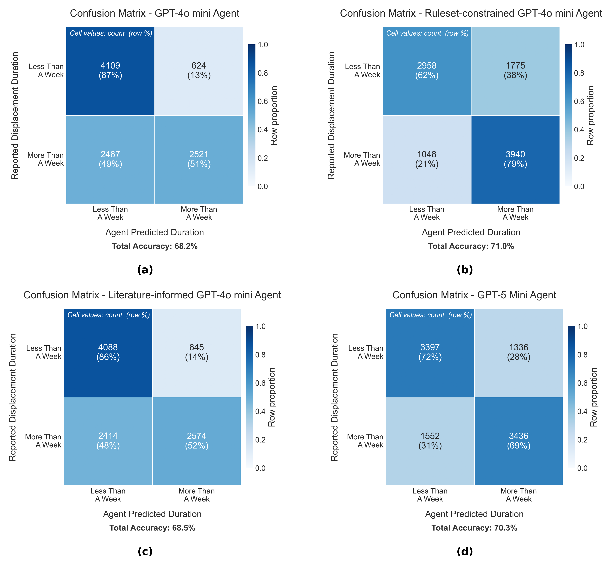
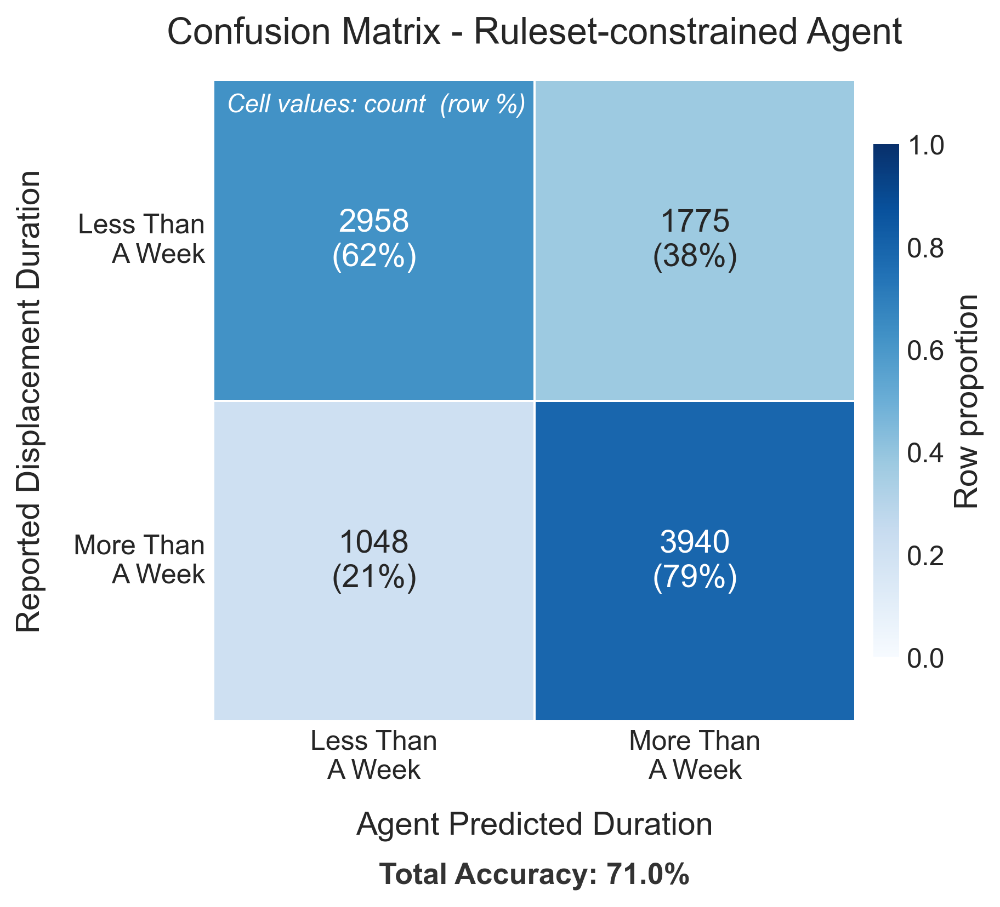

Example 6
=========

Example 6 shows how a household generative agent implemented in pyrecodes is validated using the US Census Household Pulse Survey. The generative agent makes decisions using an LLM conditioned on its socio-economic parameters, building damage, and access to infrastructure services. This example shows how to construct the generative agent, provide inputs, and compare its outputs with the decision-making of real households in the US.

        Confusion matrices comparing generative agent decisions to reported household displacement durations for all prompting strategies.

Running the example
-------------------

Example 6 Jupyter notebook illustrates how to construct a household generative agent, prompt it with data from the Household Pulse Survey, and evaluate its displacement decisions against actual reported outcomes using confusion matrices.

.. note::

    Example 6 is a standalone notebook — it does not use ``main.run()``. Install pyrecodes with the ``household`` extra before running it:

    .. code-block:: bash

        pip install "pyrecodes[household]"

    An OpenAI API key is also required, provided in an ``openai_api_key.json`` file in the root of the repository in the format ``{"API_KEY": "your-key-here"}``.

.. hint::

    By default, the notebook processes 10 randomly sampled households. The prompting strategy can be changed by setting ``PROMPTING_STRATEGY`` to ``None`` (baseline GPT), ``'ReadLiterature'``, or ``'ReadRuleset'``.

The example can be run locally by downloading the `Example 6 Jupyter notebook <https://github.com/NikolaBlagojevic/pyrecodes/blob/main/Example6_SingleGenerativeAgentValidation.ipynb>`_ and the required files from the `Example 6 folder <https://github.com/NikolaBlagojevic/pyrecodes/tree/main/Example%206>`_.

Input data
----------

The input data for Example 6 is the `US Census Household Pulse Survey <https://www.census.gov/programs-surveys/household-pulse-survey.html>`_, filtered to households that reported disaster-related displacement. The survey data is read from ``household_pulse_survey_displaced.csv`` in the Example 6 folder.

Each household is characterized by:

- **Socio-economic parameters**: state, MSA, tenure, income, number of occupants, children by age group, and employment status.
- **Building damage**: damage level reported by the household.
- **Disaster type**: the type of disaster experienced.
- **Infrastructure access**: access to water, power, food, and sanitary conditions.
- **Displacement duration**: whether the household was displaced for less than or more than a week (the ground truth label used for validation).

Households with any missing parameter or that experienced more than one disaster type are excluded from the analysis.

Generative agent
----------------

The generative agent is implemented in the ``HouseholdSurveyGPT`` class. The agent is prompted in three stages:

1. **Disaster context** — the agent is informed about the type and severity of the disaster.
2. **Socio-economic profile** — the agent is provided with the household's socio-economic parameters.
3. **Situation narrative** — the agent is given a description of the household's building damage and access to infrastructure services.

The agent then decides whether the household leaves home for less than a week or more than a week.

Prompting strategies
--------------------

Three prompting strategies are available and can be set via the ``PROMPTING_STRATEGY`` parameter:

- ``None`` — baseline GPT with no additional guidance.
- ``'ReadLiterature'`` — the agent is informed by relevant academic literature on household displacement.
- ``'ReadRuleset'`` — the agent is constrained by a decision ruleset derived from the literature.

        Confusion matrix for the ruleset-constrained generative agent (``'ReadRuleset'`` strategy).

The notebook prints the full prompt–answer exchange for each household. The excerpt below shows a single agent run — from disaster context through the final displacement decision:

.. code-block:: text

    ════════════════════════════════════════════════════════════════════════════════
      HOUSEHOLD 1 / 1
    ════════════════════════════════════════════════════════════════════════════════

    ┌─ PROMPT — DISASTER CONTEXT ──────────────────────────────────────────────────
    │  # Context
    │  You are a household in a home that experienced a Hurricane.
    │  - In the following your household socioeconomic characteristics will be
    │  provided first, followed by a description of your current situation.
    │  - Based on your socioeconomic characteristics and your current situation
    │  you need to inform us about your estimate on how long you will be
    │  displaced from home.
    │  Important:
    │  - This message is context only. Do not produce output yet.
    └───────────────────────────────────────────────────────────────────────────────

    ┌─ ANSWER — DISASTER CONTEXT ──────────────────────────────────────────────────
    │  Understood. I will wait for the socioeconomic characteristics and
    │  current situation details before providing my estimate.
    └───────────────────────────────────────────────────────────────────────────────

    ┌─ PROMPT — SOCIOECONOMIC PROFILE ─────────────────────────────────────────────
    │  Socioeconomic characteristics of your household:
    │  - You are in Florida Miami-Fort Lauderdale-Pompano Beach, FL.
    │  - You are Owner of the building you live in.
    │  - Your household income level is $100,000 - $149,999.
    │  - There are 2 people in your household. Out of those 0 are children
    │  below 5 years of age, 0 are children between 5 and 11 years of age,
    │  and 0 are children between 12 and 17 years of age.
    │  - Your household members are employed.
    │  Important:
    │  - This message is context only. Do not produce output yet.
    └───────────────────────────────────────────────────────────────────────────────

    ┌─ ANSWER — SOCIOECONOMIC PROFILE ─────────────────────────────────────────────
    │  Understood. I will wait for the description of my current situation
    │  before providing my displacement estimate.
    └───────────────────────────────────────────────────────────────────────────────

    ┌─ PROMPT — SITUATION NARRATIVE ────────────────────────────────────────────────
    │  Your current situation:
    │  - Due to the Hurricane, your property and your possessions experienced
    │  some damage.
    │  - In the first month after the Hurricane, you experience always having
    │  access to water.
    │  - In the first month after the Hurricane, you experience always having
    │  electricity.
    │  - In the first month after the Hurricane, you experience always having
    │  enough food to eat.
    │  - In the first month after the Hurricane, you experience never living
    │  in unsanitary conditions.
    │
    │  Task:
    │  Based on the current situation described above, which one of the
    │  following do you believe will be your most likely displacement duration:
    │  LeaveHomeForLessThanAWeek, LeaveHomeForMoreThanAWeek.
    └───────────────────────────────────────────────────────────────────────────────

    ┌─ ANSWER — AGENT DECISION ─────────────────────────────────────────────────────
    │  1. Relevant facts: My property experienced some damage from the
    │  Hurricane. I am an owner in Miami. I always had access to water,
    │  electricity, food, and never lived in unsanitary conditions.
    │
    │  2. Since the damage to my property is only "some damage" and all
    │  essential services remained available, the disruption to daily life is
    │  relatively minor. As a homeowner with stable income and no dependents,
    │  I can manage temporary displacement quickly.
    │
    │  LeaveHomeForLessThanAWeek
    └───────────────────────────────────────────────────────────────────────────────

      Agent decision:                  LeaveHomeForLessThanAWeek
      Actual displacement duration:    Less than a week  ✓

Results
-------

Agent decisions are compared against reported displacement durations using a confusion matrix. The displacement duration reported in the survey is mapped to the agent's binary decision space: ``LeaveHomeForLessThanAWeek`` or ``LeaveHomeForMoreThanAWeek``. Total accuracy is reported below each confusion matrix.
