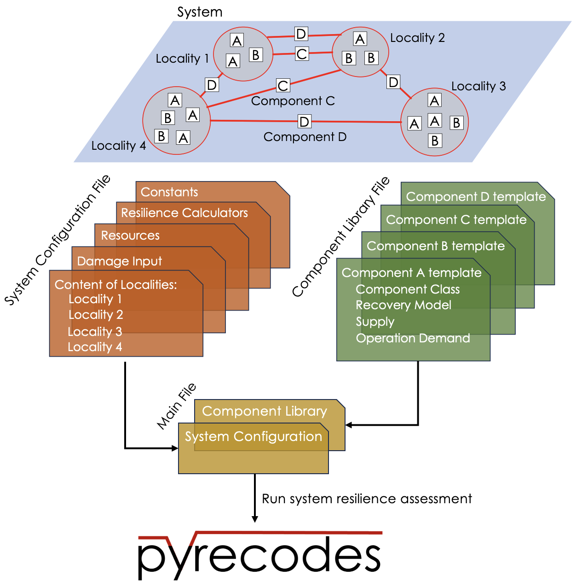

How to use pyrecodes?
=====================

To assess system resilience in **pyrecodes**, the input that user needs to define is structured in three files:

- **component library**
- **system configuration**
- **main**

**Component library** defines templates for component objects to be instantiated in the system. **System configuration** file defines the system by specifying the spatial distribution of components, damage input model, resource parameters, resilience calculators, and temporal discretization of the system. **Main** file specifies the class of the system configuration and component library objects and is used to run the system resilience assessment.

The three files are defined as JSONs and the following figure illustrates the relationship between them and a system in **pyrecodes**:

        A system in **pyrecodes** is defined by the system configuration file and the component library file. Main file specifies the class of the system configuration and component library files and is used to run the system resilience assessment.

Here is a Youtube video that explains the basics of pyrecodes and how to use it:

.. youtube:: IFUcdtKTWoo?si=ZHjTYemi9ce2b4nq

Component Library
-----------------

A system in **pyrecodes** is discretized into components. As such components can be numerous but still share similar characteristics (e.g., residential buildings and commercial buildings), to avoid defining each component individually **pyrecodes** allows users to define a component library with component templates. This library enables users to define common parameters once and then customize specific attributes for individual components later when system is created, reducing redundancy in parameter input while maintaining consistency. Each component template consists of the following parameters:

- **Component class**: defines the type of the **pyrecodes** component class.

- **Recovery model**: defines the recovery model of the component and its parameters.

- **Supply**: defines the resource supply of the component - resources that the component provides to the system and how their amount relates to component's functionality and unmet demand.

- **Operation demand**: defines the operation demand of the component - resources that the component needs to operate and how their amount relates to component's functionality.

.. hint::

    Variables in square brackets need to be replaced with appropriate class names or values. Please check out the `Documentation <./documentation.html>`_ page for the available classes and their parameter format and the `Examples <examples.html>`_ page to see how they are implemented.

Component library contains component template parameters in the following format:

.. toggle::

    ::

        {
            [ComponentName]: {
                "ComponentClass": [ComponentClassDefinition],
                "RecoveryModel": {
                    "FileName": [ComponentRecoveryModelFileName],
                    "ClassName": [ComponentRecoveryModelClassName],
                    "Parameters": [ComponentRecoveryModelClassParameters],
                    "DamageFunctionalityRelation": {
                        "Type": [RelationClassName]
                    }
                },
                "Supply": {
                    [ResourceName]: {
                        "Amount": [Amount],
                        "FunctionalityToAmountRelation": [RelationClassName],
                        "UnmetDemandToAmountRelation": [RelationClassName]
                    }
                },
                "OperationDemand": {
                    [ResourceName]: {
                        "Amount": [Amount],
                        "FunctionalityToAmountRelation": [RelationClassName]
                    }
                }
            }
        }

System configuration
--------------------

The system configuration file defines the spatial distribution of components, thus defining the system. Additionally, it defines the damage input model, resource parameters, resilience calculators, and temporal discretization of the system.

In terms of spatial discretization, components in **pyrecodes** are located in geographical units called localities. Resources can freely flow within localities without needing links. Links, which are components themselves, connect components across localities, enabling resource transfer between them. This spatial discretization simplifies modeling by not considering links within a locality. One can still consider links among each component by placing each component in a separate locality. On the other hand, placing all components in a single locality (Example 3) allows one to not consider any links, and thus simplify resilience assessment. In terms of coordinates, **pyrecodes** can define the coordinate of a locality through its centroid (Examples 1 and 2), as a bounding box (Examples 3 and 4) or a geojson file (Example 5). Components can also have their coordinates, but are not required as long as component's locality is defined.

The system configuration file defines the following:

- **Constants**: temporal discretization of the system and system-class specific constants.
- **Content of Localities**: number and type of components located in and between localities.
- **Damage input**: damage input model and its parameters.
- **Resources**: resource parameters including their resource distribution models and component priorities.
- **Resilience calculators**: resilience calculators and their parameters.

System configuration file is structured as follows:

.. toggle::

    ::

        {
            "Constants": {
                "START_TIME_STEP": [Value],
                "MAX_TIME_STEP": [Value],
                "DISASTER_TIME_STEP": [Value],
                "[SystemClassSpecificParameters]": [Values]            
            },
            "Content": {
                [LocalityName]: [LocalityCoordinatesAndContent],
            },
            "DamageInput": {
                "FileName": [DamageInputFileName],
                "ClassName": [DamageInputClassName],
                "Parameters": [DamageInputClassParameters]
            },
            "Resources": {
                [ResourceName]: {
                    "Group": [ResourceGroupName],
                    "DistributionModel": {
                        "FileName": [ResourceDistributionModelFileName],
                        "ClassName": [ResourceDistributionModelClassName],
                        "Parameters": {
                            [DistributionModelParameters]
                        }
                    }
                }
            },
            "ResilienceCalculator": [
                {
                    "FileName": [ResilienceCalculatorFileName],
                    "ClassName": [ResilienceCalculatorClassName],
                    "Parameters": {
                        [ResilienceCalculatorClassParameters]
                        }
                }
            ]
        }

Main
----

Finally, the user needs to define the main file, which specifies the class of the **pyrecodes** system configuration and component library and calls already defined JSON files :

.. toggle::

    ::

        {
            "ComponentLibrary": {
                "ComponentLibraryCreatorFileName": [ComponentLibraryCreatorFileName],
                "ComponentLibraryCreatorClassName": [ComponentLibraryCreatorClassName],
                "ComponentLibraryFile": [PathToComponentLibraryFile]
            },
            "System": {
                "SystemCreatorClassName": [SystemCreatorClassName],
                "SystemCreatorFileName": [SystemCreatorClassName],
                "SystemClass": [SystemClassName],
                "SystemConfigurationFile": [PathToSystemConfigurationFile]
            }
        }

How to run the model
--------------------

Once the three files are defined, the model can be run using the following command:

.. code-block:: Python

    import pyrecodes
    system = pyrecodes.main.run('./path/to/main/file')

When the simulation is finished, user can save the system object containing the simulation outputs:

.. code-block:: Python

    system.save_as_pickle('savename')

The outputs can be loaded later as follows: 

.. code-block:: Python

    system = pyrecodes.main.load_system('savename')

.. hint::

    Note that saving and loading the system object which uses third-party infrastructure simulators is not possible in the current version of pyrecodes.

Output visualization
--------------------

Outputs of a **pyrecodes** resilience assessment are resource supply/demand/consumption dynamics during the resilience assessment interval. Such information provides insights into the system's resilience by assessing unmet resource demand after an event and the system's ability to meet its resilience goals. Additionally, gantt charts are employed to visualize the recovery progress of individual components, aiding in the comprehension of the overall system's recovery dynamics. Finally, certain system classes allow for the visualization of the system's spatial distribution and its evolution over time (Examples 3, 4 and 5).

The results are vizualised using the `Plotter <./documentation/plotter_docs.html>`_ and `GeoVisualizer <./documentation/geovisualizer_docs.html>`_ class. Note that the available visulization tools depend on the employed System class. Please check out the `Examples <examples.html>`_.

