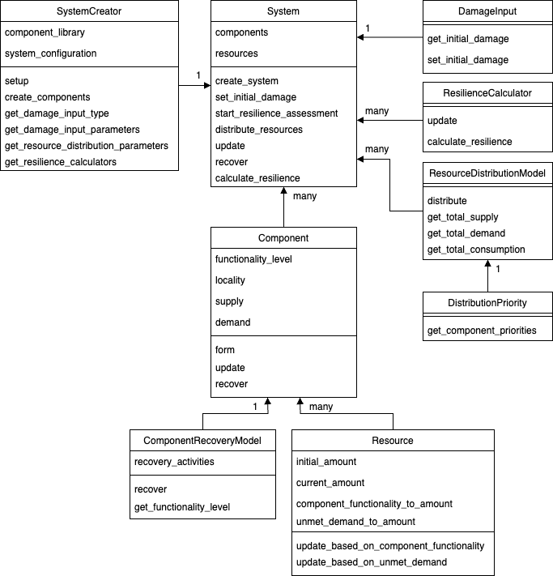

What is pyrecodes?
==================

As disasters worlwide are becoming more frequent and severe, there is a growing need for tools that can help communities and cities assess their disaster resilience and identify the most effective resilience improvement strategies. **pyrecodes** is an open-source Python library for regional disaster recovery simulation and disaster resilience assessment of the built environment with the primary goal to respond to this pressing need. **pyrecodes** is based on the iRe-CoDeS framework developed in the research group of Professor Božidar Stojadinović at the `Chair of Structural Dynamics and Earthquake Engineering <https://stojadinovic.ibk.ethz.ch/>`_ at ETH Zurich, Switzerland.

.. figure:: ../figures/1slide_iRe-CoDeS.gif
        :alt: Overview of the iRe-CoDeS framework.

        Overview of the iRe-CoDeS framework.

iRe-CoDeS framework
--------------------

The iRe-CoDeS framework for disaster resilience quantification discretizes a system into components and simulates the change in components' supply and demand for various resources over the post-disaster recovery period. Components' interactions are captured by simulating the flow of operation and recovery resources among components and conditioning their ability to operate and recover on their resource demand fulfillment. System's resilience is then assessed by contrasting the post-disaster system-level evolution of supply, demand and consumption of various resources and identifying the magnitude and duration of unmet resource demands in the system.

The iRe-CoDeS framework has been used to: 

(click to the side of the figure to cycle through, and in the center to see further details):

.. carousel::
    :show_captions_below:
    :show_controls:
    :show_indicators:

    .. figure:: ../figures/SF_HousingRecovery_small.gif
        :target: https://www.research-collection.ethz.ch/handle/20.500.11850/587004
        
        Simulate recovery impeding factors and the effect of regional resource constraints on the recovery of San Francisco following a hypothetical earthquake.
                                        
        Figures show the simulated building-level recovery and the resulting increase in regional shelter capacity and demand for repair crews.

    .. figure:: ../figures/irecodes_SIE_paper_EP_plot.png
        :target: https://doi.org/10.1080/15732479.2022.2052912

        Capture cascading effects caused by interdependencies among infrastructure systems following a disaster. 

        Figures shows supply, demand and consumption of electric power after a scenario earthquake in the virtual community. Dashed lines represent supply/consumption dynamics withouth considering infrastructure interdependencies, while solid lines include interdependencies. Gray LoR area marks the unmet demand for electric power caused by infrastructure interdependencies.

    .. figure:: ../figures/irecodes_workflow.png
        :target: https://www.research-collection.ethz.ch/bitstream/handle/20.500.11850/463555/1/7d-0003_Published.pdf

        Conduct scenario-based seismic resilience assessment of a virtual community by integrating iRe-CoDeS with ground motion models and HAZUS fragility and recovery functions.

        Figure shows the workflow of resilience assessment in iRe-CoDeS which extends the traditional regional risk assessment by simulating recovery and quantifying resilience.

    .. figure:: ../figures/17WCEE_LoR_LossCurves_CIS_1.png
        :target: https://www.research-collection.ethz.ch/handle/20.500.11850/463549
        
        Conduct probabilistic seismic resilience assessment of a virtual community and obtain risk-based resilience metrics.
        
        Figure shows probabilistic resilience assessment results as the mean annual rate of exceeding a certain value of a Lack of Resilience (LoR) - the unmet demand for a resource, here electric power, during the resilience assessment period.

    .. figure:: ../figures/sobol_indices_EPSS.png
        :target: https://www.sciencedirect.com/science/article/pii/S0951832022003702
        
        Quantify component importance for disaster resilience of a system using Sobol' indices and a heuristic upper and lower-bound search.
        
        Figure shows component importance ranking for the resilience of an electric power supply system in a virtual community.

    .. figure:: ../figures/substation_resilience.png
        :target: https://onlinelibrary.wiley.com/doi/pdf/10.1002/eqe.3800
        
        Assess seismic resilience of an electrical substation.
        
        Figure shows resilience assessment of an electrical substation using the iRe-CoDeS framework.

    .. figure:: ../figures/irecodes_NIST_goals.png
        :target: https://www.research-collection.ethz.ch/handle/20.500.11850/586997
        
        Evaluate NIST community resilience goals.
        
        Figure shows how NIST resilience goals can be assessed using iRe-CoDeS by defining functionality of a system as the percent of met user demand for a resource provided by the considered system.

    .. figure:: ../figures/irecodes_housing_resilience_lifelines2021.png
        :target: https://ascelibrary.org/doi/abs/10.1061/9780784484432.082
        
        Assess housing resilience of a virtual community exposed to seismic hazard.
                
        Figure shows that by treating housing as a resource provided by the building stock, iRe-CoDeS can assess housing resilience by looking at post-disaster housing supply/demand dynamics.

    .. figure:: ../figures/adequate_worker_supply_kraljevo.png
        :target: https://www.research-collection.ethz.ch/handle/20.500.11850/586957
        
        Assess the adequate post-disaster supply of recovery resources for the city of Kraljevo, Serbia to improve its seismic resilience.
                
        Figure shows that the relation between recovery resource supply, in this case workers, and recovery time can be assessed using iRe-CoDeS.

    .. figure:: ../figures/lor_surface_example.png
        :target: https://www.researchgate.net/publication/363671446_Risk-Informed_Resilience_Assessment_of_Communities_using_Lack_of_Resilience_Surfaces

        Enable risk-informed resilience assessment using Lack of Resilience surfaces.
                        
        Figure shows an example of an LoR surface showing the annual rate of exceeding a certain percent of unmet resource demand (i.e., the LoR) at each time step of the simulated recovery process.

    .. figure:: ../figures/kraljevo_housing_resilience_validation.png
        :target: https://www.research-collection.ethz.ch/handle/20.500.11850/586954
        
        Compare the iRe-CoDeS seismic housing resilience assessment with a real-life post-earthquake recovery of the city of Kraljevo, Serbia.
                                
        Figure compares the iRe-CoDeS seismic housing recovery estimates with the observed housing recovery data from the 2010 Kraljevo, Serbia, earthquake.

    .. figure:: ../figures/transportation_infrastructure_community_resilience.png
        :target: https://www.research-collection.ethz.ch/handle/20.500.11850/527466
        
        Capture the impact of transportation infrastructure on community disaster resilience in a virtual community.
                                                        
        Figure shows that post-disaster inoperability of the damaged transportation infrastructure prevents access to damaged components, delaying their repair and preventing the mobilization of available workers.

    .. figure:: ../figures/f-rec_irecodes_example.png
        :target: https://www.research-collection.ethz.ch/handle/20.500.11850/610946
                
        Integrate advanced building-component-level functional recovery modelling framework F-Rec with iRe-CoDeS.
                                                                        
        Figure shows that by integrating F-Rec building-level recovery models into the regional iRe-CoDeS recovery model we capture recovery resource constraints on a building component level at each floor in the entire region.

More information on the iRe-CoDeS framework can be found `here <https://www.research-collection.ethz.ch/handle/20.500.11850/605682>`_.

pyrecodes architecture
----------------------

Following figure represents the simplified object-oriented architecture of **pyrecodes**.

        Simplified architecture of pyrecodes.